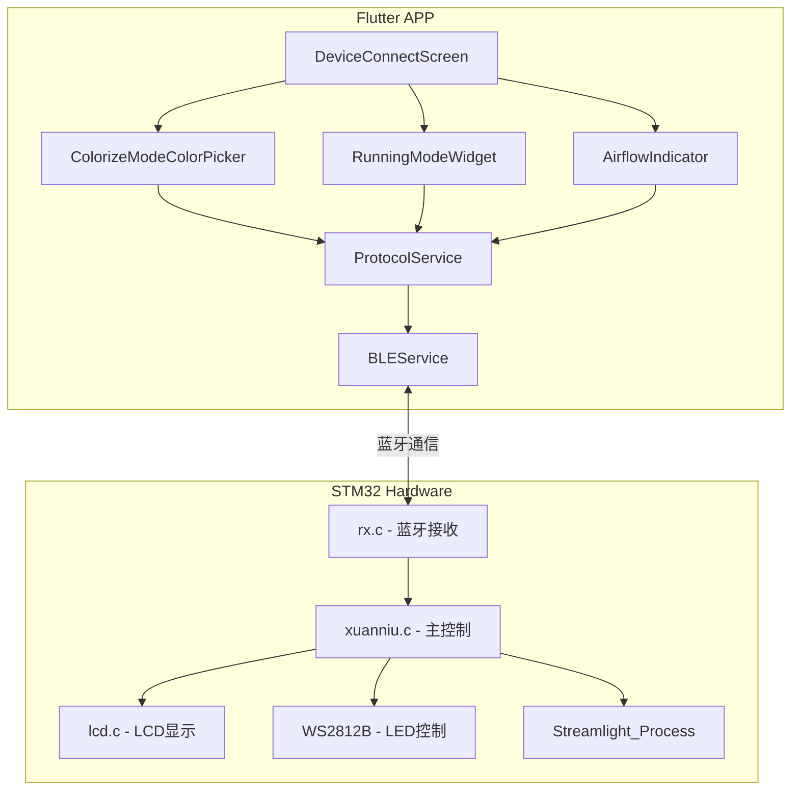
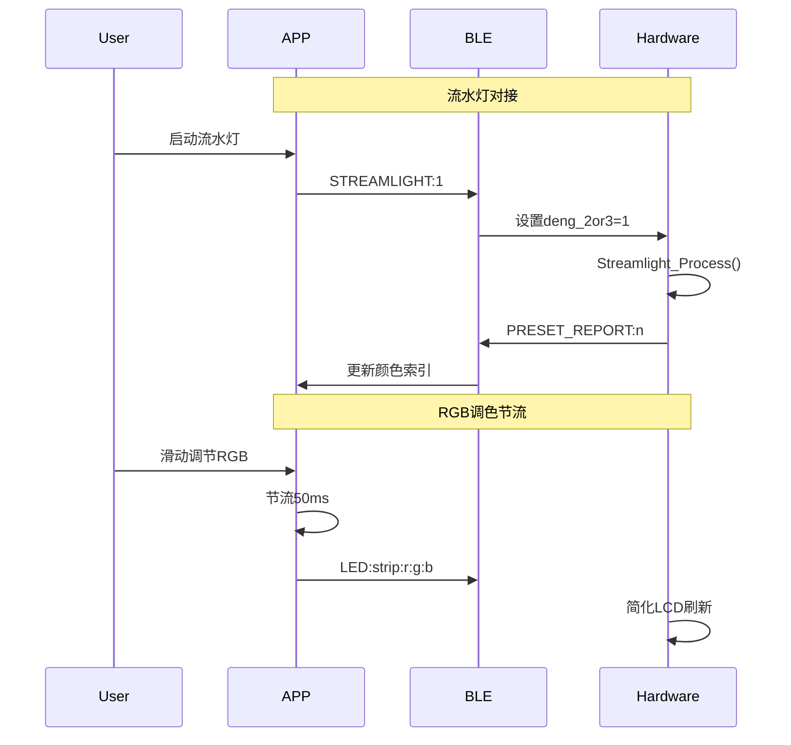
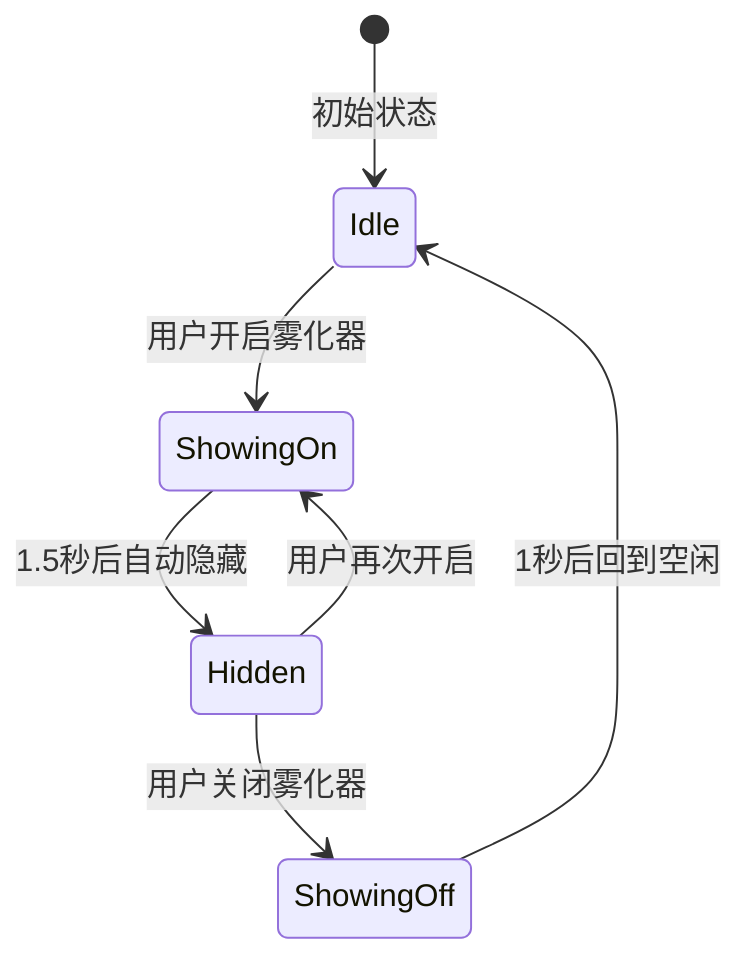

# 设计文档

## 概述

本设计文档描述了RideWind APP与STM32硬件端协同工作中5个bug的修复方案。修复涉及流水灯对接、RGB调色界面刷新优化、倒三角指示器颜色匹配、雾化器显示优化以及油门加速数字跳动效果。

## 架构

### 系统架构图



### 数据流图



## 组件和接口

### 1. 流水灯控制模块

#### 新增协议命令

```dart
// protocol_service.dart 新增方法

/// 设置流水灯模式
/// [enable] true=开启流水灯, false=关闭流水灯
Future<bool> setStreamlightMode(bool enable) async {
  String command = 'STREAMLIGHT:${enable ? 1 : 0}\n';
  try {
    await bleService.sendString(command);
    return true;
  } catch (e) {
    return false;
  }
}

/// 解析流水灯状态报告
/// 响应格式: STREAMLIGHT_REPORT:0 或 STREAMLIGHT_REPORT:1
bool? parseStreamlightReport(String response) {
  RegExp regex = RegExp(r'STREAMLIGHT_REPORT:(\d+)');
  Match? match = regex.firstMatch(response.trim());
  if (match != null) {
    return int.parse(match.group(1)!) == 1;
  }
  return null;
}
```

#### 硬件端修改

```c
// rx.c 新增命令处理
else if(strncmp(cmd, "STREAMLIGHT:", 12) == 0) {
    int enable = atoi(cmd + 12);
    deng_2or3 = enable ? 1 : 0;
    printf("OK:STREAMLIGHT:%d\r\n", deng_2or3);
}
```

### 2. RGB调色节流模块

#### 节流器实现

```dart
// colorize_mode_throttler.dart

class ColorizeThrottler {
  static const int _minIntervalMs = 50;
  DateTime _lastSendTime = DateTime.now();
  
  /// 检查是否可以发送命令
  bool canSend() {
    final now = DateTime.now();
    if (now.difference(_lastSendTime).inMilliseconds >= _minIntervalMs) {
      _lastSendTime = now;
      return true;
    }
    return false;
  }
  
  /// 重置节流器
  void reset() {
    _lastSendTime = DateTime.fromMillisecondsSinceEpoch(0);
  }
}
```

### 3. 倒三角指示器同步模块

#### 颜色匹配算法

```dart
// color_matcher.dart

class ColorMatcher {
  /// 根据RGB值找到最接近的预设索引
  static int findClosestPreset(int r, int g, int b, List<Map<String, dynamic>> presets) {
    int closestIndex = 0;
    double minDistance = double.infinity;
    
    for (int i = 0; i < presets.length; i++) {
      final preset = presets[i];
      final led2 = preset['led2'] as Map<String, int>;
      
      double distance = _colorDistance(
        r, g, b,
        led2['r']!, led2['g']!, led2['b']!
      );
      
      if (distance < minDistance) {
        minDistance = distance;
        closestIndex = i;
      }
    }
    
    return closestIndex;
  }
  
  static double _colorDistance(int r1, int g1, int b1, int r2, int g2, int b2) {
    return sqrt(pow(r1 - r2, 2) + pow(g1 - g2, 2) + pow(b1 - b2, 2));
  }
}
```

### 4. 雾化器指示器模块

#### 状态机设计



#### 实现代码

```dart
// airflow_indicator_controller.dart

class AirflowIndicatorController {
  Timer? _hideTimer;
  final Duration _showOnDuration = const Duration(milliseconds: 1500);
  final Duration _showOffDuration = const Duration(milliseconds: 1000);
  
  ValueNotifier<bool> isVisible = ValueNotifier(false);
  ValueNotifier<bool> isOn = ValueNotifier(false);
  
  void showOnIndicator() {
    isVisible.value = true;
    isOn.value = true;
    _hideTimer?.cancel();
    _hideTimer = Timer(_showOnDuration, () {
      isVisible.value = false;
    });
  }
  
  void showOffIndicator() {
    isVisible.value = true;
    isOn.value = false;
    _hideTimer?.cancel();
    _hideTimer = Timer(_showOffDuration, () {
      isVisible.value = false;
    });
  }
  
  void dispose() {
    _hideTimer?.cancel();
  }
}
```

### 5. 油门加速动画模块

#### 乱序递增算法

```dart
// throttle_acceleration.dart

class ThrottleAccelerator {
  final Random _random = Random();
  
  /// 生成乱序递增步长序列
  /// 返回1-3之间的随机步长，但保证整体趋势向上
  int getNextStep() {
    // 基础步长1，加上0-2的随机值
    return 1 + _random.nextInt(3);
  }
  
  /// 回退模式：固定步长1
  int getFallbackStep() {
    return 1;
  }
}
```

#### 数字跳动动画

```dart
// speed_bounce_animation.dart

class SpeedBounceAnimation {
  /// 创建弹跳动画控制器
  static AnimationController createBounceController(TickerProvider vsync) {
    return AnimationController(
      duration: const Duration(milliseconds: 150),
      vsync: vsync,
    );
  }
  
  /// 创建缩放动画
  static Animation<double> createScaleAnimation(AnimationController controller) {
    return TweenSequence<double>([
      TweenSequenceItem(
        tween: Tween(begin: 1.0, end: 1.3).chain(CurveTween(curve: Curves.easeOut)),
        weight: 50,
      ),
      TweenSequenceItem(
        tween: Tween(begin: 1.3, end: 1.0).chain(CurveTween(curve: Curves.bounceOut)),
        weight: 50,
      ),
    ]).animate(controller);
  }
  
  /// 创建位移动画（向上弹跳）
  static Animation<double> createOffsetAnimation(AnimationController controller) {
    return TweenSequence<double>([
      TweenSequenceItem(
        tween: Tween(begin: 0.0, end: -15.0).chain(CurveTween(curve: Curves.easeOut)),
        weight: 40,
      ),
      TweenSequenceItem(
        tween: Tween(begin: -15.0, end: 0.0).chain(CurveTween(curve: Curves.bounceOut)),
        weight: 60,
      ),
    ]).animate(controller);
  }
}
```

## 数据模型

### 流水灯状态模型

```dart
class StreamlightState {
  final bool isEnabled;
  final int currentPresetIndex;
  final int phase; // 0-99 渐变进度
  
  StreamlightState({
    required this.isEnabled,
    required this.currentPresetIndex,
    this.phase = 0,
  });
}
```

### 雾化器指示器状态模型

```dart
enum AirflowIndicatorState {
  idle,      // 空闲，不显示
  showingOn, // 显示开启提示
  hidden,    // 隐藏但雾化器开启
  showingOff // 显示关闭提示
}

class AirflowIndicatorModel {
  final AirflowIndicatorState state;
  final bool isAirflowOn;
  final DateTime? stateChangeTime;
  
  AirflowIndicatorModel({
    required this.state,
    required this.isAirflowOn,
    this.stateChangeTime,
  });
}
```

### 油门加速状态模型

```dart
class ThrottleAccelerationState {
  final int currentSpeed;
  final int targetSpeed;
  final bool isAccelerating;
  final bool useRandomStep; // true=乱序模式, false=固定步长1
  final double bounceScale; // 当前弹跳缩放值
  final double bounceOffset; // 当前弹跳位移值
  
  ThrottleAccelerationState({
    required this.currentSpeed,
    required this.targetSpeed,
    required this.isAccelerating,
    this.useRandomStep = true,
    this.bounceScale = 1.0,
    this.bounceOffset = 0.0,
  });
}
```

## 正确性属性

*正确性属性是在所有有效执行中都应该成立的特征或行为——本质上是关于系统应该做什么的形式化陈述。属性作为人类可读规范和机器可验证正确性保证之间的桥梁。*

### Property 1: 流水灯命令发送正确性

*For any* 流水灯状态切换操作（开启或关闭），APP发送的命令格式应为 `STREAMLIGHT:0` 或 `STREAMLIGHT:1`，且命令内容与用户操作意图一致。

**Validates: Requirements 1.1, 1.2**

### Property 2: RGB调色命令节流

*For any* 连续的RGB滑动调节操作序列，相邻两次LED命令发送的时间间隔应不小于50ms。

**Validates: Requirements 2.1, 2.5**

### Property 3: 预设索引同步正确性

*For any* 硬件端返回的有效预设索引（1-12），APP端的Triangle_Indicator位置应等于该索引减1（转换为0-based索引）。

**Validates: Requirements 3.2, 3.3**

### Property 4: 颜色预设本地存储一致性

*For any* 用户选择的颜色预设索引，保存到本地存储后再读取，应返回相同的索引值（round-trip属性）。

**Validates: Requirements 3.5**

### Property 5: 雾化器指示器显示时长

*For any* 雾化器开启操作，绿色指示器显示时长应在1400ms-1600ms范围内（允许±100ms误差）。

**Validates: Requirements 4.1, 4.2**

### Property 6: 雾化器指示器非持续显示

*For any* 雾化器处于开启状态且超过显示时长后，指示器的可见性应为false。

**Validates: Requirements 4.3**

### Property 7: 油门加速步长范围

*For any* 油门加速操作中的单次速度递增，步长应在1-3范围内（乱序模式）或恒为1（回退模式）。

**Validates: Requirements 5.1, 5.4**

### Property 8: 油门加速速度准确性

*For any* 油门加速过程，最终速度值应等于初始速度加上所有步长的累加值，且不超过最大速度340。

**Validates: Requirements 5.6**

## 错误处理

### 蓝牙通信错误

| 错误场景 | 处理策略 |
|---------|---------|
| 流水灯命令发送失败 | 显示错误提示，保持当前状态，提供重试选项 |
| 预设查询超时 | 使用本地缓存的预设索引，不阻塞UI |
| LED命令发送失败 | 静默忽略，下次滑动时重试 |
| 雾化器命令失败 | 显示错误提示，提供重试选项 |

### 状态同步错误

| 错误场景 | 处理策略 |
|---------|---------|
| 硬件预设索引超出范围 | 使用默认索引0 |
| 本地存储读取失败 | 使用默认值 |
| 动画控制器异常 | 跳过动画，直接更新数值 |

## 测试策略

### 单元测试

1. **ColorizeThrottler测试**
   - 测试节流间隔是否正确
   - 测试重置功能

2. **ColorMatcher测试**
   - 测试颜色距离计算
   - 测试最近预设查找

3. **ThrottleAccelerator测试**
   - 测试乱序步长范围
   - 测试回退模式步长

4. **AirflowIndicatorController测试**
   - 测试状态转换
   - 测试定时器行为

### 属性测试

使用 `fast_check` 库进行属性测试，每个属性测试运行100次迭代。

```dart
// 示例：节流属性测试
test('Property 2: RGB调色命令节流', () {
  fc.check(
    fc.property(
      fc.integer(min: 10, max: 100), // 操作次数
      (count) {
        final throttler = ColorizeThrottler();
        final sendTimes = <DateTime>[];
        
        for (int i = 0; i < count; i++) {
          if (throttler.canSend()) {
            sendTimes.add(DateTime.now());
          }
          // 模拟快速操作
          await Future.delayed(Duration(milliseconds: 10));
        }
        
        // 验证相邻发送间隔 >= 50ms
        for (int i = 1; i < sendTimes.length; i++) {
          final interval = sendTimes[i].difference(sendTimes[i-1]).inMilliseconds;
          expect(interval, greaterThanOrEqualTo(50));
        }
      },
    ),
    numRuns: 100,
  );
});
```

### 集成测试

1. **流水灯端到端测试**
   - 验证APP命令 → 硬件响应 → APP状态更新的完整流程

2. **RGB调色流畅性测试**
   - 验证滑动操作时硬件LCD不卡顿

3. **雾化器指示器动画测试**
   - 验证动画时长和状态转换

4. **油门加速视觉测试**
   - 验证数字跳动效果的流畅性
