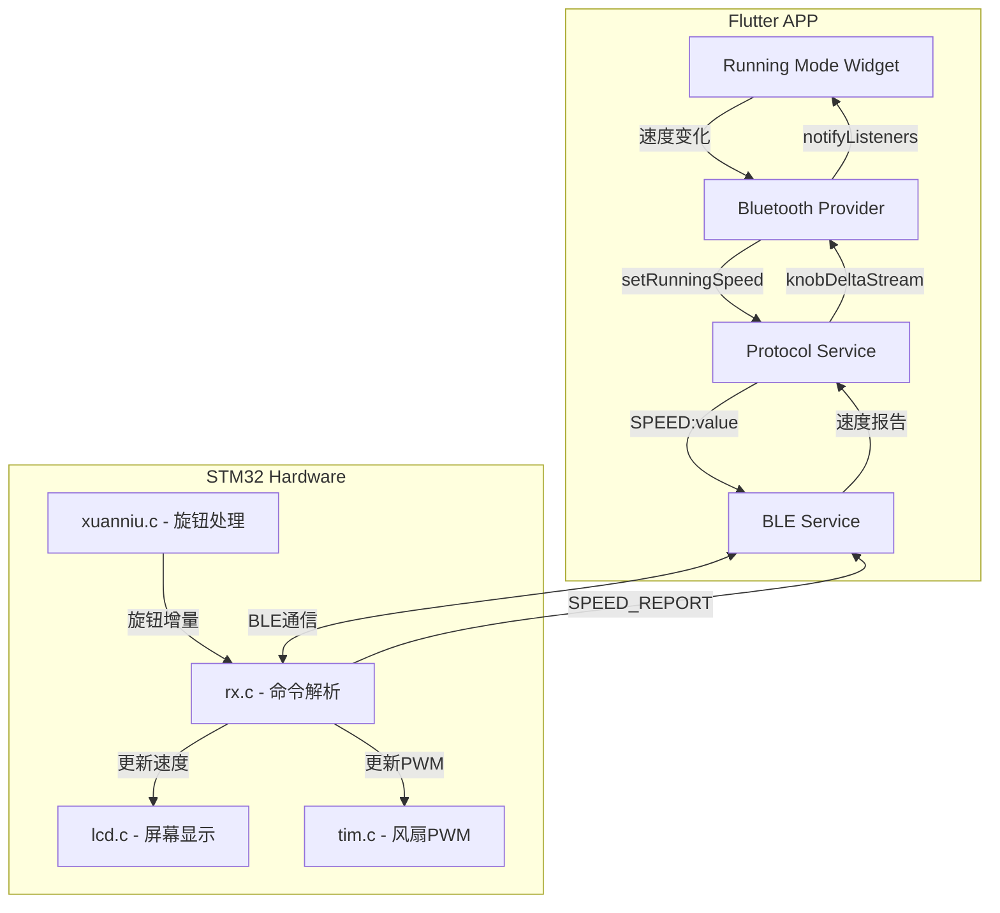
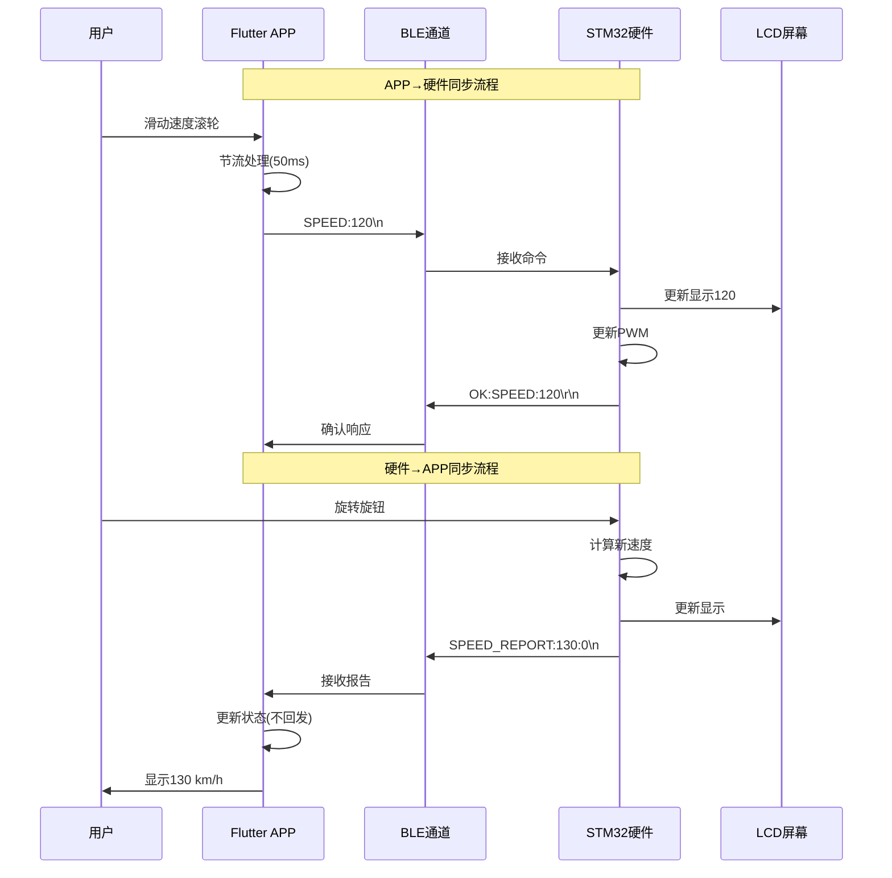

# Design Document: Bidirectional Speed Sync

## Overview

本设计文档描述了 RideWind 项目中硬件端与APP端双向速度同步功能的技术架构和实现方案。该功能实现了：

1. **APP→硬件同步**: APP调整速度时，通过BLE发送SPEED命令，硬件更新LCD显示和风扇PWM
2. **硬件→APP同步**: 硬件旋钮调整速度时，通过BLE发送SPEED_REPORT，APP更新Running Mode界面
3. **状态一致性**: 两端维护统一的速度状态，避免冲突和循环更新

## Architecture

### 系统架构图



### 数据流架构



## Components and Interfaces

### 1. Protocol Service (APP端协议层)

**文件**: `lib/services/protocol_service.dart`

**新增接口**:

```dart
/// 发送速度命令到硬件
/// [speed] 速度值 (0-340)
Future<bool> setRunningSpeed(int speed);

/// 解析硬件上报的速度
/// 响应格式: SPEED_REPORT:value:unit\n
SpeedReport? parseSpeedReport(String response);

/// 速度报告数据流
Stream<SpeedReport> get speedReportStream;
```

### 2. Bluetooth Provider (APP端状态管理)

**文件**: `lib/providers/bluetooth_provider.dart`

**新增接口**:

```dart
/// 当前速度值 (来自硬件或本地)
int get currentRunningSpeed;

/// 速度报告流 (硬件主动上报)
Stream<SpeedReport> get speedReportStream;

/// 设置运行速度 (发送到硬件)
Future<bool> setRunningSpeed(int speed);

/// 标记：是否正在接收硬件报告 (防止循环更新)
bool _isReceivingReport = false;
```

### 3. Running Mode Widget (APP端UI组件)

**文件**: `lib/widgets/running_mode_widget.dart`

**新增接口**:

```dart
/// 外部速度报告流 (来自硬件旋钮)
final Stream<SpeedReport>? externalSpeedStream;

/// 速度变化回调 (通知外部)
final Function(int speed, bool fromHardware) onSpeedChanged;
```

### 4. Hardware Protocol Handler (硬件端协议处理)

**文件**: `Core/Src/rx.c`

**新增功能**:

```c
/// 上报速度到APP
/// @param speed 当前速度值
/// @param unit 单位 (0=km/h, 1=mph)
void BLE_ReportSpeed(int16_t speed, uint8_t unit);

/// 处理来自APP的速度命令
/// @param speed 目标速度值
void Protocol_HandleSpeed(int16_t speed);
```

## Data Models

### SpeedReport (速度报告)

```dart
class SpeedReport {
  final int speed;      // 速度值 (0-340)
  final int unit;       // 单位 (0=km/h, 1=mph)
  final int timestamp;  // 时间戳
  final bool fromHardware; // 是否来自硬件
  
  SpeedReport({
    required this.speed,
    required this.unit,
    required this.timestamp,
    this.fromHardware = true,
  });
}
```

### SpeedState (速度状态)

```dart
class SpeedState {
  int currentSpeed;     // 当前速度
  int targetSpeed;      // 目标速度 (用于动画)
  int unit;             // 当前单位
  bool isThrottleMode;  // 是否油门模式
  DateTime lastUpdate;  // 最后更新时间
  String source;        // 更新来源 ('app' | 'hardware')
}
```

### 协议消息格式

| 方向 | 消息类型 | 格式 | 示例 |
|------|---------|------|------|
| APP→HW | 设置速度 | `SPEED:value\n` | `SPEED:120\n` |
| APP→HW | 设置单位 | `UNIT:0/1\n` | `UNIT:0\n` |
| APP→HW | 油门模式 | `THROTTLE:0/1\n` | `THROTTLE:1\n` |
| APP→HW | 查询速度 | `GET:SPEED\n` | `GET:SPEED\n` |
| HW→APP | 速度报告 | `SPEED_REPORT:value:unit\n` | `SPEED_REPORT:130:0\n` |
| HW→APP | 油门报告 | `THROTTLE_REPORT:0/1\n` | `THROTTLE_REPORT:1\n` |
| HW→APP | 速度响应 | `SPEED:value:unit\r\n` | `SPEED:120:0\r\n` |
| HW→APP | 确认响应 | `OK:SPEED:value\r\n` | `OK:SPEED:120\r\n` |

## Correctness Properties

*A property is a characteristic or behavior that should hold true across all valid executions of a system-essentially, a formal statement about what the system should do. Properties serve as the bridge between human-readable specifications and machine-verifiable correctness guarantees.*

### Property 1: Protocol Round-Trip Consistency

*For any* valid speed value (0-340), serializing it to a SPEED command and then parsing the acknowledgment response should produce the same speed value.

**Validates: Requirements 1.2, 1.4, 6.2, 6.3, 6.4, 6.5**

### Property 2: Speed State Consistency

*For any* sequence of speed updates from either APP or hardware, after all updates are processed, both APP and hardware should have the same current speed value.

**Validates: Requirements 3.2, 3.4**

### Property 3: Speed Calculation Correctness

*For any* current speed value and knob delta, the new speed should equal `clamp(currentSpeed + delta * stepSize, 0, maxSpeed)`.

**Validates: Requirements 2.3, 3.1**

### Property 4: No Feedback Loop

*For any* SPEED_REPORT message received by APP, the APP should update its internal state without sending a new SPEED command back to hardware.

**Validates: Requirements 3.3**

### Property 5: Unit Conversion Correctness

*For any* speed value in km/h, converting to mph and back should produce a value within ±1 of the original (due to rounding).

**Validates: Requirements 4.3, 4.4**

### Property 6: Command Throttling

*For any* sequence of rapid speed changes (faster than 50ms interval), the number of SPEED commands sent should not exceed 20 per second.

**Validates: Requirements 8.1**

### Property 7: Throttle Mode Independence

*For any* SPEED command received while in throttle mode, the hardware should update the speed display without changing the throttle mode state.

**Validates: Requirements 5.4**

### Property 8: Query Response Format

*For any* GET:SPEED query, the response should match the format `SPEED:value:unit\r\n` where value is 0-340 and unit is 0 or 1.

**Validates: Requirements 7.4**

## Error Handling

### 1. 通信错误处理

| 错误类型 | 检测方式 | 处理策略 |
|---------|---------|---------|
| 命令超时 | 3秒无响应 | 重试1次，失败则提示用户 |
| 格式错误 | 解析失败 | 忽略并记录日志 |
| 连接断开 | connectionStream | 显示断开状态，本地继续工作 |
| 值越界 | 范围检查 | 自动clamp到有效范围 |

### 2. 状态冲突处理

```dart
/// 冲突解决策略：最后写入者胜出
void _handleSpeedConflict(int appSpeed, int hwSpeed, DateTime appTime, DateTime hwTime) {
  if (hwTime.isAfter(appTime)) {
    // 硬件更新更新，采用硬件值
    _currentSpeed = hwSpeed;
    _updateUIWithoutSendingCommand();
  } else {
    // APP更新更新，保持APP值
    _currentSpeed = appSpeed;
    // 命令已发送，等待硬件确认
  }
}
```

### 3. 重连同步策略

```dart
void _onReconnected() async {
  // 1. 查询硬件当前状态
  final result = await querySpeedSync();
  
  if (result['success']) {
    // 2. 同步到APP
    _currentSpeed = result['speed'];
    _currentUnit = result['unit'];
    notifyListeners();
  }
}
```

## Testing Strategy

### 单元测试

1. **协议解析测试**: 验证所有消息格式的解析和序列化
2. **状态管理测试**: 验证速度状态的更新和通知
3. **节流逻辑测试**: 验证命令发送频率限制

### 属性测试 (Property-Based Testing)

使用 `dart_check` 库进行属性测试：

```dart
// 测试框架配置
// 每个属性测试运行至少100次迭代
const int minIterations = 100;
```

**测试属性**:

1. **Property 1**: 协议往返一致性
2. **Property 2**: 状态一致性
3. **Property 3**: 速度计算正确性
4. **Property 4**: 无反馈循环
5. **Property 5**: 单位转换正确性
6. **Property 6**: 命令节流
7. **Property 7**: 油门模式独立性
8. **Property 8**: 查询响应格式

### 集成测试

1. **APP→硬件同步测试**: 验证滑块操作同步到LCD
2. **硬件→APP同步测试**: 验证旋钮操作同步到APP
3. **双向冲突测试**: 验证同时操作时的状态一致性
4. **断线重连测试**: 验证重连后的状态同步
