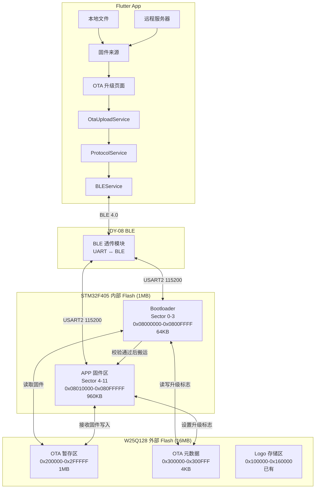
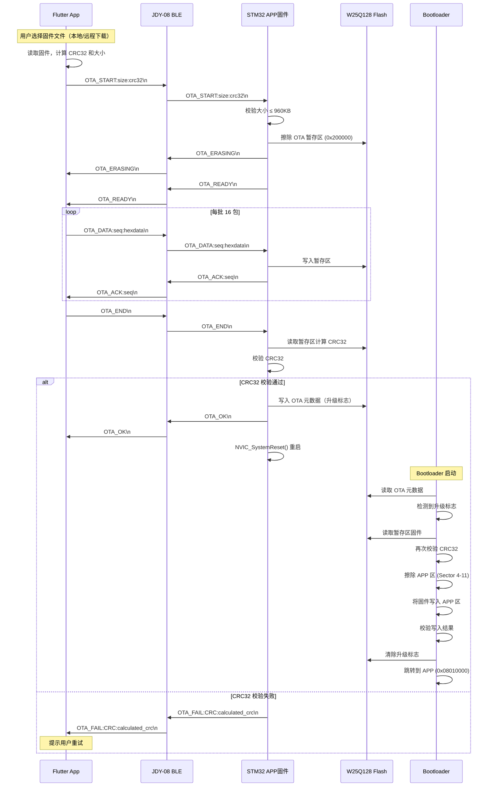
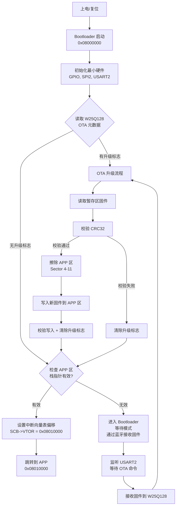

# 设计文档：蓝牙 OTA 固件升级

## 概述

本功能为 RideWind 项目实现基于 JDY-08 BLE 透传模块的 STM32F405 OTA（Over-The-Air）固件升级。系统采用 **Bootloader + APP 双分区** 架构，利用外部 W25Q128 SPI Flash 作为固件暂存区。Flutter App 通过蓝牙将固件文件分包发送至 STM32，STM32 接收并暂存到 W25Q128，校验通过后由 Bootloader 将新固件从外部 Flash 搬运到内部 Flash APP 区完成升级。

支持两种升级模式：**本地 OTA**（App 直接选择本地固件文件）和 **远程 OTA**（App 从服务器下载固件后通过蓝牙传输）。整体协议设计复用现有 Logo 上传的成熟模式（START/DATA/END + CRC32 校验 + ACK 流控），确保传输可靠性。

升级过程中若发生断电或传输失败，系统具备回滚能力：Bootloader 检测到 APP 区固件无效时，保持在 Bootloader 模式等待重新升级，不会变砖。

## 架构

### 系统整体架构



### STM32 Flash 分区布局

```
┌─────────────────────────────────────────────────────────────┐
│                  STM32F405 内部 Flash (1MB)                   │
├──────────┬──────────┬──────────────────────────────────────────┤
│ Sector   │ 大小     │ 用途                                     │
├──────────┼──────────┼──────────────────────────────────────────┤
│ 0 (16KB) │          │ Bootloader 代码                          │
│ 1 (16KB) │ 64KB     │ Bootloader 代码                          │
│ 2 (16KB) │ 合计     │ Bootloader 代码                          │
│ 3 (16KB) │          │ Bootloader 代码 + 升级标志(Sector3末尾)   │
├──────────┼──────────┼──────────────────────────────────────────┤
│ 4 (64KB) │          │ APP 固件（中断向量表起始）                 │
│ 5 (128KB)│ 960KB    │ APP 固件                                 │
│ 6 (128KB)│ 合计     │ APP 固件                                 │
│ ...      │          │ APP 固件                                 │
│ 11(128KB)│          │ APP 固件                                 │
└──────────┴──────────┴──────────────────────────────────────────┘

┌─────────────────────────────────────────────────────────────┐
│                  W25Q128 外部 Flash (16MB)                    │
├──────────────────┬──────────────────────────────────────────┤
│ 地址范围          │ 用途                                     │
├──────────────────┼──────────────────────────────────────────┤
│ 0x000000-0x000FFF│ 系统配置（已有，LED参数等）                │
│ 0x100000-0x160000│ Logo 存储区（已有，3个槽位）               │
│ 0x200000-0x2FFFFF│ OTA 固件暂存区（1MB，新增）               │
│ 0x300000-0x300FFF│ OTA 元数据区（4KB，新增）                  │
└──────────────────┴──────────────────────────────────────────┘
```

## 主要工作流程

### OTA 升级完整流程



### Bootloader 启动流程



## 组件和接口

### 组件 1：Bootloader（STM32 端）

**用途**：系统启动时运行，负责检查升级标志、执行固件搬运、跳转到 APP

**接口**：
```c
// bootloader.h - Bootloader 核心接口

#define BOOTLOADER_ADDR       0x08000000
#define APP_ADDR              0x08010000
#define APP_MAX_SIZE          (960 * 1024)  // 960KB

// W25Q128 OTA 区域定义
#define OTA_STAGING_ADDR      0x200000      // 固件暂存区起始
#define OTA_STAGING_SIZE      (1024 * 1024) // 1MB
#define OTA_META_ADDR         0x300000      // 元数据区起始

// OTA 元数据魔数
#define OTA_META_MAGIC        0x4F544155    // "OTAU"
#define OTA_META_VERSION      0x01

// 跳转到 APP
void Bootloader_JumpToApp(uint32_t appAddr);

// 检查 APP 区是否有效（栈指针检查）
bool Bootloader_IsAppValid(uint32_t appAddr);

// 检查是否需要升级
bool Bootloader_CheckUpgradeFlag(void);

// 执行固件搬运：W25Q128 → 内部 Flash APP 区
bool Bootloader_PerformUpgrade(void);

// 清除升级标志
void Bootloader_ClearUpgradeFlag(void);
```

**职责**：
- 上电后最先运行，初始化最小硬件（SPI2 用于 W25Q128，USART2 用于蓝牙通信）
- 检查 W25Q128 中的 OTA 元数据，判断是否需要升级
- 执行固件搬运：从 W25Q128 暂存区读取固件，擦除内部 Flash APP 区，写入新固件
- APP 区有效时跳转到 APP；无效时进入等待模式，通过蓝牙接收新固件

### 组件 2：OTA 接收模块（STM32 APP 端）

**用途**：在 APP 固件中运行，负责通过蓝牙接收固件数据并写入 W25Q128 暂存区

**接口**：
```c
// ota.h - OTA 接收模块接口

typedef enum {
    OTA_STATE_IDLE = 0,
    OTA_STATE_ERASING,
    OTA_STATE_RECEIVING,
    OTA_STATE_VERIFYING,
    OTA_STATE_COMPLETE,
    OTA_STATE_ERROR
} OtaState_t;

// OTA 元数据结构（存储在 W25Q128 0x300000）
typedef struct {
    uint32_t magic;           // 魔数 OTA_META_MAGIC
    uint8_t  version;         // 元数据版本
    uint8_t  upgradeFlag;     // 升级标志：0=无升级，1=待升级
    uint8_t  reserved[2];     // 保留
    uint32_t firmwareSize;    // 固件大小
    uint32_t firmwareCRC;     // 固件 CRC32
    uint32_t appVersion;      // APP 版本号（可选）
} OtaMeta_t;

// 初始化 OTA 模块
void OTA_Init(void);

// 解析 OTA 命令（从 BLE_ParseCommand 调用）
void OTA_ParseCommand(char* cmd);

// 获取当前状态
OtaState_t OTA_GetState(void);

// 获取进度百分比
uint8_t OTA_GetProgress(void);
```

**职责**：
- 解析 OTA_START / OTA_DATA / OTA_END 命令
- 将接收到的固件数据写入 W25Q128 暂存区
- CRC32 校验通过后写入升级元数据，触发系统重启
- 复用 Logo 上传的批量写入 + ACK 流控机制

### 组件 3：OTA 上传服务（Flutter 端）

**用途**：Flutter App 中负责固件文件读取、分包发送、升级流程管理

**接口**：
```dart
// ota_upload_service.dart

enum OtaState {
  idle,
  preparing,    // 读取固件、计算CRC
  erasing,      // 等待STM32擦除Flash
  uploading,    // 分包发送中
  verifying,    // 等待CRC校验
  rebooting,    // 等待设备重启
  complete,
  error,
}

class OtaUploadService {
  final BluetoothProvider _btProvider;
  
  // 协议参数（与 Logo 上传一致）
  static const int packetSize = 16;       // 每包数据大小
  static const int windowSize = 16;       // 滑动窗口（每16包等待ACK）
  static const int ackTimeoutMs = 5000;   // ACK 超时
  static const int maxRetries = 3;        // 最大重试次数
  static const int packetDelayMs = 8;     // 包间延迟
  
  // 回调
  Function(String)? onLog;
  Function(double)? onProgress;
  Function(OtaState)? onStateChanged;
  Function(String)? onError;
  Function()? onSuccess;
  
  /// 开始 OTA 升级
  Future<bool> upload(Uint8List firmwareData);
  
  /// 取消升级
  void cancel();
  
  /// 获取当前状态
  OtaState get state;
}
```

## 数据模型

### OTA 元数据（W25Q128 @ 0x300000）

```c
// 存储在 W25Q128 外部 Flash 的 OTA 元数据
// 大小：16 字节，占用 1 个扇区（4KB）
typedef struct {
    uint32_t magic;           // 0x4F544155 ("OTAU")
    uint8_t  version;         // 元数据格式版本 = 0x01
    uint8_t  upgradeFlag;     // 0x00=无升级, 0x01=待升级
    uint8_t  reserved[2];     // 保留对齐
    uint32_t firmwareSize;    // 固件字节数（≤ 960KB）
    uint32_t firmwareCRC;     // 固件 CRC32 校验值
} OtaMeta_t;  // sizeof = 16 bytes
```

**校验规则**：
- `magic` 必须等于 `0x4F544155`
- `version` 必须等于 `0x01`
- `upgradeFlag` 为 `0x01` 时表示有待执行的升级
- `firmwareSize` 必须 > 0 且 ≤ 960KB (0xF0000)
- `firmwareCRC` 必须与暂存区固件实际 CRC32 匹配

### OTA 协议命令集

```
┌──────────────────────────────────────────────────────────────────┐
│ 命令                          │ 方向        │ 说明               │
├──────────────────────────────────────────────────────────────────┤
│ OTA_START:size:crc32          │ App → STM32 │ 开始升级           │
│ OTA_ERASING                   │ STM32 → App │ 正在擦除Flash      │
│ OTA_READY                     │ STM32 → App │ 准备接收           │
│ OTA_DATA:seq:hexdata          │ App → STM32 │ 固件数据包         │
│ OTA_ACK:seq                   │ STM32 → App │ 确认收到（每16包）  │
│ OTA_NAK:seq                   │ STM32 → App │ 请求重传           │
│ OTA_RESEND:seq                │ STM32 → App │ 从指定序号重传     │
│ OTA_END                       │ App → STM32 │ 传输结束           │
│ OTA_OK                        │ STM32 → App │ 校验通过，即将重启  │
│ OTA_FAIL:reason:detail        │ STM32 → App │ 升级失败           │
│ OTA_PROGRESS                  │ App → STM32 │ 查询进度           │
│ OTA_VERSION                   │ App → STM32 │ 查询当前固件版本   │
│ OTA_VERSION:major.minor.patch │ STM32 → App │ 返回版本号         │
│ OTA_ABORT                     │ App → STM32 │ 中止升级           │
└──────────────────────────────────────────────────────────────────┘
```

## 关键函数与形式化规约

### 函数 1：Bootloader_JumpToApp()

```c
void Bootloader_JumpToApp(uint32_t appAddr)
{
    typedef void (*pFunction)(void);
    
    uint32_t appStack = *(__IO uint32_t*)appAddr;
    uint32_t appEntry = *(__IO uint32_t*)(appAddr + 4);
    
    // 关闭所有中断
    __disable_irq();
    
    // 关闭所有外设中断（NVIC）
    for (uint8_t i = 0; i < 8; i++) {
        NVIC->ICER[i] = 0xFFFFFFFF;  // 禁用中断
        NVIC->ICPR[i] = 0xFFFFFFFF;  // 清除挂起
    }
    
    // 关闭 SysTick
    SysTick->CTRL = 0;
    SysTick->LOAD = 0;
    SysTick->VAL  = 0;
    
    // 设置中断向量表偏移
    SCB->VTOR = appAddr;
    
    // 设置主栈指针
    __set_MSP(appStack);
    
    // 重新使能中断
    __enable_irq();
    
    // 跳转到 APP
    pFunction jumpToApp = (pFunction)appEntry;
    jumpToApp();
}
```

**前置条件**：
- `appAddr` 是 Flash 中有效的 APP 起始地址（0x08010000）
- `*appAddr` 处的栈指针值在 RAM 范围内（0x20000000 - 0x20030000）
- `*(appAddr+4)` 处的复位向量指向有效的 Flash 地址
- 所有 DMA 传输已停止

**后置条件**：
- 中断向量表已重定向到 `appAddr`
- 主栈指针已设置为 APP 的初始栈指针
- 程序计数器跳转到 APP 的 Reset_Handler
- 此函数不会返回

**循环不变量**：N/A（无循环）

### 函数 2：Bootloader_PerformUpgrade()

```c
bool Bootloader_PerformUpgrade(void)
{
    OtaMeta_t meta;
    uint8_t buffer[256];  // 页大小缓冲区
    
    // 1. 读取并校验元数据
    W25Q128_BufferRead((uint8_t*)&meta, OTA_META_ADDR, sizeof(meta));
    if (meta.magic != OTA_META_MAGIC || meta.upgradeFlag != 0x01) {
        return false;
    }
    if (meta.firmwareSize == 0 || meta.firmwareSize > APP_MAX_SIZE) {
        return false;
    }
    
    // 2. 校验暂存区固件 CRC32
    uint32_t crc = CRC32_CalculateFlash(OTA_STAGING_ADDR, meta.firmwareSize);
    if (crc != meta.firmwareCRC) {
        Bootloader_ClearUpgradeFlag();
        return false;
    }
    
    // 3. 解锁内部 Flash
    HAL_FLASH_Unlock();
    
    // 4. 擦除 APP 区（Sector 4-11）
    FLASH_EraseInitTypeDef eraseInit;
    uint32_t sectorError;
    eraseInit.TypeErase = FLASH_TYPEERASE_SECTORS;
    eraseInit.Sector = FLASH_SECTOR_4;
    eraseInit.NbSectors = 8;  // Sector 4-11
    eraseInit.VoltageRange = FLASH_VOLTAGE_RANGE_3;
    
    if (HAL_FLASHEx_Erase(&eraseInit, &sectorError) != HAL_OK) {
        HAL_FLASH_Lock();
        return false;
    }
    
    // 5. 从 W25Q128 读取固件，写入内部 Flash
    uint32_t remaining = meta.firmwareSize;
    uint32_t srcAddr = OTA_STAGING_ADDR;
    uint32_t dstAddr = APP_ADDR;
    
    while (remaining > 0) {
        uint32_t chunkSize = (remaining > 256) ? 256 : remaining;
        W25Q128_BufferRead(buffer, srcAddr, chunkSize);
        
        // 按字（4字节）写入内部 Flash
        for (uint32_t i = 0; i < chunkSize; i += 4) {
            uint32_t word = *(uint32_t*)&buffer[i];
            if (HAL_FLASH_Program(FLASH_TYPEPROGRAM_WORD, dstAddr + i, word) != HAL_OK) {
                HAL_FLASH_Lock();
                return false;
            }
        }
        
        srcAddr += chunkSize;
        dstAddr += chunkSize;
        remaining -= chunkSize;
    }
    
    HAL_FLASH_Lock();
    
    // 6. 校验写入结果
    uint32_t verifyCrc = 0;
    // 直接从内部 Flash 计算 CRC32
    verifyCrc = CRC32_Calculate((uint8_t*)APP_ADDR, meta.firmwareSize);
    if (verifyCrc != meta.firmwareCRC) {
        return false;  // 写入校验失败
    }
    
    // 7. 清除升级标志
    Bootloader_ClearUpgradeFlag();
    
    return true;
}
```

**前置条件**：
- W25Q128 已初始化且可正常读写
- OTA 元数据区（0x300000）包含有效的升级元数据
- 暂存区（0x200000）包含完整的固件数据
- 系统运行在 Bootloader 模式，APP 区可被擦除

**后置条件**：
- 成功时：APP 区（0x08010000 起）包含新固件，CRC32 校验通过，升级标志已清除
- 失败时：升级标志已清除（CRC 校验失败时），APP 区可能处于不完整状态
- W25Q128 暂存区数据保持不变（不擦除，便于重试）

**循环不变量**：
- `srcAddr - OTA_STAGING_ADDR == dstAddr - APP_ADDR`（源和目标偏移始终同步）
- `remaining + (dstAddr - APP_ADDR) == meta.firmwareSize`（已写入 + 剩余 = 总大小）
- 所有已写入的字节与 W25Q128 中的源数据一致

### 函数 3：OTA_ParseCommand()

```c
void OTA_ParseCommand(char* cmd)
{
    char response[64];
    
    // OTA_START:size:crc32 - 开始 OTA 升级
    if (strncmp(cmd, "OTA_START:", 10) == 0) {
        uint32_t size = 0, crc = 0;
        char* p = cmd + 10;
        size = strtoul(p, &p, 10);
        if (*p == ':') crc = strtoul(p + 1, NULL, 10);
        
        // 校验固件大小
        if (size == 0 || size > APP_MAX_SIZE) {
            sprintf(response, "OTA_FAIL:SIZE_INVALID:%lu\n", (unsigned long)APP_MAX_SIZE);
            BLE_SendString(response);
            return;
        }
        
        ota_state = OTA_STATE_ERASING;
        BLE_SendString("OTA_ERASING\n");
        
        // 擦除 W25Q128 暂存区（1MB = 16 个 64KB Block）
        for (int i = 0; i < 16; i++) {
            W25Q128_EraseBlock(OTA_STAGING_ADDR + i * 65536);
        }
        
        // 初始化接收状态
        ota_total_size = size;
        ota_received_size = 0;
        ota_expected_crc = crc;
        ota_current_seq = 0;
        ota_flash_written = 0;
        ota_state = OTA_STATE_RECEIVING;
        
        Buffer_Init();
        ota_window.totalPackets = (size + 15) / 16;
        ota_window.lastAckSeq = 0;
        ota_window.flashWriteCount = 0;
        ota_window.batchByteCount = 0;
        
        BLE_SendString("OTA_READY\n");
    }
    
    // OTA_DATA:seq:hexdata - 固件数据包
    else if (strncmp(cmd, "OTA_DATA:", 9) == 0) {
        if (ota_state != OTA_STATE_RECEIVING) {
            BLE_SendString("OTA_FAIL:NOT_READY\n");
            return;
        }
        
        char* p = cmd + 9;
        uint32_t seq = strtoul(p, &p, 10);
        if (*p != ':') {
            BLE_SendString("OTA_FAIL:FORMAT\n");
            return;
        }
        char* hexData = p + 1;
        
        int decodedLen = HexDecode(hexData, ota_temp_buffer, sizeof(ota_temp_buffer));
        if (decodedLen <= 0) {
            sprintf(response, "OTA_NAK:%lu\n", (unsigned long)seq);
            BLE_SendString(response);
            return;
        }
        
        // 序号校验
        uint32_t expectedSeq = (ota_current_seq == 0 && ota_received_size == 0) ? 0 : ota_current_seq + 1;
        if (seq != expectedSeq) {
            if (seq < expectedSeq) return;  // 重复包，忽略
            sprintf(response, "OTA_RESEND:%lu\n", (unsigned long)expectedSeq);
            BLE_SendString(response);
            return;
        }
        
        // 写入批量缓冲区
        if (ota_window.flashWriteCount == 0) {
            ota_window.batchByteCount = 0;
        }
        memcpy(&ota_window.flashWriteBuffer[ota_window.batchByteCount], ota_temp_buffer, decodedLen);
        ota_window.batchByteCount += decodedLen;
        ota_window.flashWriteCount++;
        ota_received_size += decodedLen;
        ota_current_seq = seq;
        
        // 每 16 包或最后一包时批量写入 Flash
        bool isLastPacket = (seq == ota_window.totalPackets - 1);
        bool batchComplete = (ota_window.flashWriteCount >= 16);
        
        if (batchComplete || isLastPacket) {
            uint32_t writeAddr = OTA_STAGING_ADDR + ota_flash_written;
            W25Q128_BufferWrite(ota_window.flashWriteBuffer, writeAddr, ota_window.batchByteCount);
            ota_flash_written += ota_window.batchByteCount;
            
            ota_window.flashWriteCount = 0;
            ota_window.batchByteCount = 0;
            
            sprintf(response, "OTA_ACK:%lu\n", (unsigned long)seq);
            BLE_SendString(response);
        }
    }
    
    // OTA_END - 传输结束，校验
    else if (strcmp(cmd, "OTA_END") == 0) {
        if (ota_state != OTA_STATE_RECEIVING) {
            BLE_SendString("OTA_FAIL:NOT_RECEIVING\n");
            return;
        }
        
        ota_state = OTA_STATE_VERIFYING;
        
        // 校验接收大小
        if (ota_received_size != ota_total_size) {
            sprintf(response, "OTA_FAIL:SIZE:%lu/%lu\n",
                    (unsigned long)ota_received_size, (unsigned long)ota_total_size);
            BLE_SendString(response);
            ota_state = OTA_STATE_ERROR;
            return;
        }
        
        // 校验 CRC32
        uint32_t calcCRC = CRC32_CalculateFlash(OTA_STAGING_ADDR, ota_total_size);
        if (calcCRC != ota_expected_crc) {
            sprintf(response, "OTA_FAIL:CRC:%lu\n", (unsigned long)calcCRC);
            BLE_SendString(response);
            ota_state = OTA_STATE_ERROR;
            return;
        }
        
        // 写入 OTA 元数据
        OtaMeta_t meta = {
            .magic = OTA_META_MAGIC,
            .version = OTA_META_VERSION,
            .upgradeFlag = 0x01,
            .firmwareSize = ota_total_size,
            .firmwareCRC = ota_expected_crc
        };
        W25Q128_EraseSector(OTA_META_ADDR);
        W25Q128_BufferWrite((uint8_t*)&meta, OTA_META_ADDR, sizeof(meta));
        
        ota_state = OTA_STATE_COMPLETE;
        BLE_SendString("OTA_OK\n");
        
        // 延迟 500ms 后重启，确保蓝牙响应发送完毕
        HAL_Delay(500);
        NVIC_SystemReset();
    }
    
    // OTA_ABORT - 中止升级
    else if (strcmp(cmd, "OTA_ABORT") == 0) {
        ota_state = OTA_STATE_IDLE;
        BLE_SendString("OTA_ABORTED\n");
    }
    
    // OTA_VERSION - 查询固件版本
    else if (strcmp(cmd, "OTA_VERSION") == 0) {
        sprintf(response, "OTA_VERSION:%d.%d.%d\n",
                FW_VERSION_MAJOR, FW_VERSION_MINOR, FW_VERSION_PATCH);
        BLE_SendString(response);
    }
}
```

**前置条件**：
- `cmd` 是以 null 结尾的有效字符串，已去除末尾换行符
- W25Q128 已初始化
- USART2（蓝牙）已初始化且可发送数据

**后置条件**：
- OTA_START：暂存区已擦除，状态切换为 RECEIVING，发送 OTA_READY
- OTA_DATA：数据已写入暂存区（批量），发送 OTA_ACK
- OTA_END 成功：元数据已写入，系统将重启
- OTA_END 失败：发送 OTA_FAIL，状态切换为 ERROR

**循环不变量**：
- OTA_DATA 处理中：`ota_flash_written + ota_window.batchByteCount == ota_received_size`（已写入Flash + 缓冲区中 = 总接收量）

### 函数 4：Flutter OtaUploadService.upload()

```dart
Future<bool> upload(Uint8List firmwareData) async {
  if (_isUploading) return false;
  _isUploading = true;
  _setupResponseListener();
  
  try {
    _setState(OtaState.preparing);
    
    // 1. 计算 CRC32
    final crc32 = _calculateCRC32(firmwareData);
    _log('固件大小: ${firmwareData.length} bytes, CRC32: 0x${crc32.toRadixString(16)}');
    
    // 2. 发送 START，等待 READY
    _setState(OtaState.erasing);
    final startOk = await _sendStartAndWaitReady(firmwareData.length, crc32);
    if (!startOk) return false;
    
    // 3. 分包发送固件数据
    _setState(OtaState.uploading);
    final dataOk = await _sendDataWithSlidingWindow(firmwareData);
    if (!dataOk) return false;
    
    // 4. 发送 END，等待校验结果
    _setState(OtaState.verifying);
    final endOk = await _sendEndAndWaitResult();
    if (!endOk) return false;
    
    // 5. 等待设备重启
    _setState(OtaState.rebooting);
    _log('设备正在重启，Bootloader 将执行固件搬运...');
    
    _setState(OtaState.complete);
    onSuccess?.call();
    return true;
    
  } catch (e) {
    _setState(OtaState.error);
    onError?.call(e.toString());
    return false;
  } finally {
    _isUploading = false;
    _responseSub?.cancel();
  }
}
```

**前置条件**：
- `firmwareData` 非空，大小 ≤ 960KB
- 蓝牙已连接且 TX/RX 特征可用
- 当前未在进行其他上传操作

**后置条件**：
- 成功时：固件已传输到 STM32，STM32 已重启进入 Bootloader 执行升级
- 失败时：返回 false，状态为 error，通过 onError 回调通知原因
- 蓝牙监听已清理

## 算法伪代码

### Bootloader 主流程算法

```c
// Bootloader main() 伪代码
ALGORITHM bootloader_main()
INPUT: 无（上电自动运行）
OUTPUT: 跳转到 APP 或进入等待模式

BEGIN
    // 最小硬件初始化（不初始化 APP 使用的外设）
    HAL_Init()
    SystemClock_Config()
    MX_GPIO_Init()       // LED 指示灯
    MX_SPI2_Init()       // W25Q128
    MX_USART2_Init()     // 蓝牙通信
    W25Q128_Init()
    
    // 检查升级标志
    IF Bootloader_CheckUpgradeFlag() THEN
        // LED 快闪表示正在升级
        success = Bootloader_PerformUpgrade()
        IF NOT success THEN
            // 升级失败，清除标志，尝试启动旧固件
            Bootloader_ClearUpgradeFlag()
        END IF
    END IF
    
    // 检查 APP 区是否有效
    IF Bootloader_IsAppValid(APP_ADDR) THEN
        Bootloader_JumpToApp(APP_ADDR)
        // 不会返回
    ELSE
        // APP 无效，进入 Bootloader 等待模式
        // 通过蓝牙接收固件（复用 OTA_ParseCommand 逻辑）
        HAL_UART_Receive_IT(&huart2, &rx_data, 1)
        WHILE true DO
            RX_proc()  // 处理蓝牙命令
            // LED 慢闪表示等待模式
        END WHILE
    END IF
END
```

### CRC32 计算算法（从 W25Q128 读取）

```c
ALGORITHM CRC32_CalculateFlash(addr, len)
INPUT: addr = W25Q128 起始地址, len = 数据长度
OUTPUT: 32位 CRC32 校验值

BEGIN
    crc ← 0xFFFFFFFF
    buffer[256]  // 256字节读取缓冲区
    remaining ← len
    currentAddr ← addr
    
    WHILE remaining > 0 DO
        // 循环不变量：crc 包含 [addr, currentAddr) 范围数据的部分 CRC
        // 循环不变量：remaining + (currentAddr - addr) == len
        
        chunkSize ← MIN(remaining, 256)
        W25Q128_BufferRead(buffer, currentAddr, chunkSize)
        
        FOR i ← 0 TO chunkSize - 1 DO
            crc ← crc XOR buffer[i]
            FOR bit ← 0 TO 7 DO
                IF (crc AND 1) THEN
                    crc ← (crc >> 1) XOR 0xEDB88320
                ELSE
                    crc ← crc >> 1
                END IF
            END FOR
        END FOR
        
        currentAddr ← currentAddr + chunkSize
        remaining ← remaining - chunkSize
    END WHILE
    
    RETURN crc XOR 0xFFFFFFFF
END
```

## 示例用法

### STM32 APP 端集成

```c
// 在 rx.c 的 BLE_ParseCommand() 中添加 OTA 命令路由
void BLE_ParseCommand(char* cmd)
{
    // ... 现有命令处理 ...
    
    // OTA 升级命令
    else if (strncmp(cmd, "OTA_", 4) == 0)
    {
        OTA_ParseCommand(cmd);
    }
    
    // ... 其他命令 ...
}

// 在 main.c 的 while(1) 循环中，OTA 接收期间跳过非必要处理
while (1)
{
    if (OTA_GetState() != OTA_STATE_RECEIVING) {
        LCD();
        Encoder();
        PWM();
        LED_GradientProcess();
        Streamlight_Process();
        Breath_Process();
    }
    RX_proc();
    // OTA 不需要 ProcessBuffer，数据在 ParseCommand 中直接写入
}
```

### APP 固件编译配置修改

```
; 修改 Keil scatter file (f4.sct)
; APP 固件起始地址从 0x08010000 开始

LR_IROM1 0x08010000 0x000F0000  {    ; APP区: 960KB
  ER_IROM1 0x08010000 0x000F0000  {
   *.o (RESET, +First)
   *(InRoot$Sections)
   .ANY (+RO)
   .ANY (+XO)
  }
  RW_IRAM1 0x20000000 0x0001C000  {
   .ANY (+RW +ZI)
  }
  RW_IRAM2 0x2001C000 0x00004000  {
   .ANY (+RW +ZI)
  }
}
```

```c
// 在 APP 的 system_stm32f4xx.c 中设置中断向量表偏移
#define VECT_TAB_OFFSET  0x10000  // APP 起始偏移 = 0x08010000 - 0x08000000
```

### Flutter 端使用示例

```dart
// 在 OTA 升级页面中使用
class OtaUpgradePage extends StatefulWidget {
  @override
  _OtaUpgradePageState createState() => _OtaUpgradePageState();
}

class _OtaUpgradePageState extends State<OtaUpgradePage> {
  late OtaUploadService _otaService;
  double _progress = 0;
  OtaState _state = OtaState.idle;
  
  void _startUpgrade() async {
    // 选择固件文件
    final result = await FilePicker.platform.pickFiles(
      type: FileType.custom,
      allowedExtensions: ['bin'],
    );
    if (result == null) return;
    
    final firmwareData = File(result.files.single.path!).readAsBytesSync();
    
    // 校验固件大小
    if (firmwareData.length > 960 * 1024) {
      _showError('固件文件过大，最大支持 960KB');
      return;
    }
    
    // 开始升级
    _otaService.onProgress = (p) => setState(() => _progress = p);
    _otaService.onStateChanged = (s) => setState(() => _state = s);
    _otaService.onError = (e) => _showError(e);
    _otaService.onSuccess = () => _showSuccess();
    
    await _otaService.upload(Uint8List.fromList(firmwareData));
  }
}
```

## Correctness Properties

*A property is a characteristic or behavior that should hold true across all valid executions of a system-essentially, a formal statement about what the system should do. Properties serve as the bridge between human-readable specifications and machine-verifiable correctness guarantees.*

### Property 1: CRC32 Cross-Platform Equivalence

*For any* byte array of length 1 to 983040, the CRC32 value computed by the Flutter App (using polynomial 0xEDB88320, initial value 0xFFFFFFFF, final XOR 0xFFFFFFFF) and the CRC32 value computed by the STM32 firmware for the same byte array shall be identical.

**Validates: Requirements 8.5, 8.1, 8.2**

### Property 2: Firmware Size Validation

*For any* firmware size value, the STM32 OTA receive module accepts the OTA_START command if and only if the size is greater than 0 and less than or equal to 983040 (960KB); the Flutter OtaUploadService rejects firmware files with size 0 or greater than 983040.

**Validates: Requirements 1.3, 2.2, 2.3**

### Property 3: Packet Splitting Round-Trip

*For any* byte array of length 1 to 983040, splitting it into 16-byte packets, hex-encoding each packet, then hex-decoding and reassembling all packets in sequence order shall produce a byte array identical to the original.

**Validates: Requirements 3.1, 3.3**

### Property 4: Sequence Number Handling

*For any* OTA receive session with expected sequence number E, when a packet arrives with sequence number S: if S == E, the packet is accepted; if S < E, the packet is silently ignored; if S > E, a RESEND request for sequence E is sent.

**Validates: Requirements 3.3, 3.4, 3.5**

### Property 5: Upgrade Flag Atomicity

*For any* OTA transfer session, the upgrade flag (upgradeFlag = 0x01) is written to W25Q128 metadata area if and only if the CRC32 computed from the staging area data matches the CRC32 declared in OTA_START; if CRC32 does not match, no upgrade flag is written.

**Validates: Requirements 4.3, 4.4, 10.3**

### Property 6: OTA Metadata Serialization Round-Trip

*For any* valid OtaMeta_t structure (magic = 0x4F544155, version = 0x01, upgradeFlag in {0x00, 0x01}, firmwareSize in [1, 983040], firmwareCRC any uint32), serializing to a 16-byte buffer then deserializing shall produce an identical structure.

**Validates: Requirements 7.1, 7.3**

### Property 7: Metadata Validation Rejects Invalid Data

*For any* 16-byte buffer where the first 4 bytes do not equal 0x4F544155 or the 5th byte does not equal 0x01, the Bootloader metadata validation shall report no valid upgrade flag present.

**Validates: Requirements 7.3, 5.2**

### Property 8: Partition Isolation Invariant

*For any* sequence of OTA operations (OTA_START, OTA_DATA, OTA_END, Bootloader upgrade), the Bootloader area (Sector 0-3, addresses 0x08000000-0x0800FFFF) shall remain unmodified; all Flash erase and write operations target only Sector 4-11.

**Validates: Requirements 10.1**

### Property 9: Invalid APP Recovery

*For any* state where the APP area (0x08010000) contains an invalid stack pointer (value outside 0x20000000-0x20030000 range), the Bootloader shall not attempt to jump to APP and shall enter wait mode to receive firmware via Bluetooth.

**Validates: Requirements 10.2, 5.6**

### Property 10: Copy Address Synchronization Invariant

*For any* point during the Bootloader firmware copy loop, the relationship (srcAddr - 0x200000) == (dstAddr - 0x08010000) holds, and (remaining + dstAddr - 0x08010000) == firmwareSize.

**Validates: Requirements 6.7, 6.2**

### Property 11: CRC-Gated Copy Safety

*For any* OTA metadata with upgradeFlag = 0x01, if the CRC32 computed from the W25Q128 staging area does not match the CRC32 recorded in the metadata, the Bootloader shall clear the upgrade flag and shall not erase the APP area (Sector 4-11).

**Validates: Requirements 6.5, 10.4**

### Property 12: OTA State Machine Command Rejection

*For any* OTA state that is not RECEIVING, when an OTA_DATA or OTA_END command is received, the OTA receive module shall respond with a failure message and shall not modify the W25Q128 staging area.

**Validates: Requirements 9.6, 9.7**

### Property 13: OTA Command Routing

*For any* BLE command string that starts with "OTA_", the BLE command parser shall route it to OTA_ParseCommand(); for any command string that does not start with "OTA_", it shall not be routed to OTA_ParseCommand().

**Validates: Requirement 11.1**

### Property 14: Progress Reporting Accuracy

*For any* OTA upload session with total packet count N, after sending packet i (0-indexed), the reported progress shall equal (i + 1) / N, monotonically increasing from 1/N to 1.0.

**Validates: Requirement 3.10**

### Property 15: OTA Abort Resets State

*For any* OTA state (ERASING, RECEIVING, VERIFYING, ERROR), when an OTA_ABORT command is received, the OTA receive module shall transition to IDLE state and respond with "OTA_ABORTED\n".

**Validates: Requirement 9.3**

### Property 16: Power-Loss Recovery via Persistent Flag

*For any* scenario where the upgrade flag is written to W25Q128 and a system reset occurs before the flag is cleared, the Bootloader shall detect the upgrade flag on the next boot and re-execute the firmware copy procedure.

**Validates: Requirements 9.4, 5.3**

### Property 17: Version Response Round-Trip

*For any* firmware version (major, minor, patch) where each component is a non-negative integer, formatting as "OTA_VERSION:major.minor.patch\n" then parsing shall recover the original (major, minor, patch) values.

**Validates: Requirements 13.1, 13.2**

### Property 18: Size Mismatch Detection at OTA_END

*For any* OTA session where the total received byte count does not equal the size declared in OTA_START, the OTA receive module shall reject the OTA_END command with an OTA_FAIL:SIZE response and shall not write the upgrade flag.

**Validates: Requirements 4.5, 10.3**
## Error Handling

### Error 1: BLE Disconnection During Transfer

**Condition**: Bluetooth disconnects during OTA_DATA transmission
**Response**: STM32 OTA state remains RECEIVING, times out and returns to IDLE; W25Q128 staging area retains received data
**Recovery**: App must restart transfer from beginning (send new OTA_START) after reconnecting

### Error 2: CRC32 Verification Failure

**Condition**: CRC32 computed at OTA_END does not match expected value
**Response**: Sends OTA_FAIL:CRC:calculated_crc, state changes to ERROR, upgrade flag is NOT written
**Recovery**: App can re-initiate OTA_START to retransmit firmware

### Error 3: Power Loss During Bootloader Copy

**Condition**: Power lost while Bootloader is writing firmware from W25Q128 to internal Flash
**Response**: On restart, Bootloader detects upgrade flag still present
**Recovery**: Re-reads firmware from W25Q128, verifies CRC32, if valid re-executes full copy procedure

### Error 4: Firmware File Too Large

**Condition**: App sends firmware larger than 960KB
**Response**: STM32 sends OTA_FAIL:SIZE_INVALID:983040, rejects upgrade
**Recovery**: App prompts user to select correct firmware file

### Error 5: APP Area Firmware Corruption

**Condition**: Copy verification fails, or Flash write error makes APP area invalid
**Response**: Bootloader detects invalid stack pointer at APP area, enters wait mode
**Recovery**: Receive new firmware via Bluetooth and upgrade (Bootloader has built-in OTA receive capability)
## Testing Strategy

### Unit Testing

- CRC32 calculation: verify with known data
- OTA metadata read/write: verify serialization/deserialization in W25Q128
- Firmware size validation: boundary tests (0, 1, 960KB, 960KB+1)
- Sequence number continuity: simulate out-of-order, duplicate, missing packets

### Property-Based Testing

**Property Test Library**: Flutter uses `glados` (Dart property-based testing)

- For any random byte array of length <= 960KB, CRC32 result is identical on App side and STM32 side
- For any packet splitting scheme (different packetSize), reassembled data is identical to original
- For any OtaMeta_t struct, serialize to W25Q128 then read back and deserialize yields identical result

### Integration Testing

- Full OTA flow: App selects firmware -> transfer -> verify -> reboot -> Bootloader copy -> APP starts
- Disconnect/reconnect test: disconnect BLE during transfer, reconnect and retransmit
- Large firmware test: firmware near 960KB limit
- Rollback test: intentionally send wrong CRC, verify system does not upgrade
## Performance Considerations

- Transfer rate: BLE 4.0 transparent mode with JDY-08, measured ~2-4 KB/s (limited by 20-byte MTU and protocol overhead)
- Estimated upgrade time: 100KB firmware ~30-50s, 500KB firmware ~2-4 minutes
- Flash erase time: W25Q128 Block Erase (64KB) ~150ms, 16 blocks ~2.4s total
- Internal Flash erase: Sector 4 (64KB) ~1s, Sector 5-11 (128KB each) ~2s each, ~15s total
- Bootloader copy time: W25Q128 read + internal Flash write, ~20-30s (including erase)
- During OTA receive: skip LCD/Encoder/PWM refresh, focus on data reception (same strategy as Logo upload)

## Security Considerations

- Firmware verification: CRC32 triple check (App compute -> STM32 receive verify -> Bootloader pre-copy verify)
- Firmware signing (optional extension): future OtaMeta_t can add SHA256 hash or ECDSA signature field
- Version rollback protection (optional extension): metadata can include version comparison to prevent downgrade
- Bootloader protection: Bootloader area (Sector 0-3) write-protected via STM32 Option Bytes to prevent accidental erase
- Transport encryption: current BLE transparent mode has no encryption; can add AES encryption at application layer if needed

## Dependencies

### STM32 Side
- HAL Library: STM32F4 HAL Driver (Flash programming, UART, SPI, GPIO)
- W25Q128 Driver: existing `w25q128.c` (SPI Flash read/write/erase)
- CRC32 Algorithm: existing `logo.c` CRC32_Calculate / CRC32_CalculateFlash
- UART Communication: existing `usart.c` + `rx.c` (BLE command send/receive)

### Flutter Side
- `flutter_blue_plus: ^1.32.12`: BLE communication
- `file_picker: ^6.0.0`: firmware file selection (new dependency)
- `provider: ^6.1.2`: state management
- `crc32_checksum` or manual implementation: CRC32 calculation
- Existing `BLEService` / `ProtocolService`: BLE communication infrastructure

### Hardware
- JDY-08 BLE module: transparent pass-through communication
- W25Q128 SPI Flash: firmware staging storage
- STM32F405RGTx: target MCU