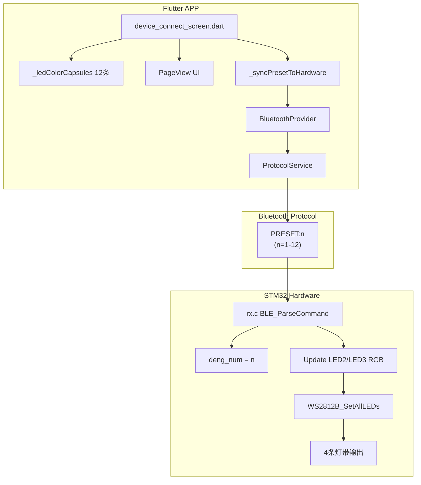

# Design Document: Color Preset Expansion

## Overview

本设计文档描述将 RideWind 车模灯光控制系统的颜色预设从 8 条扩展到 12 条的技术方案。该功能涉及 Flutter APP 端 UI 组件更新、蓝牙协议扩展、以及 STM32 硬件端固件修改。

### 设计目标

1. **色相全覆盖**: 12 条预设覆盖完整色轮（红、橙、黄、绿、青、蓝、紫、粉、白）
2. **高级感设计**: 每条配色都有独特的设计理由和视觉价值
3. **软硬件一致性**: APP 预览与实际 LED 输出颜色一致
4. **向后兼容**: 不破坏现有 1-8 预设的功能和协议

## Architecture

### 系统架构图



### 数据流

1. 用户滑动 PageView 选择颜色预设
2. `onPageChanged` 回调触发 `_syncPresetToHardware(index)`
3. 节流控制（80ms 间隔）后发送 `PRESET:n\n` 命令
4. 硬件端 `BLE_ParseCommand` 解析命令
5. 更新 `deng_num` 和 LED RGB 值
6. 调用 `WS2812B_SetAllLEDs` 更新灯带

## Components and Interfaces

### 1. APP 端组件

#### 1.1 颜色预设数据结构 (`_ledColorCapsules`)

```dart
static const List<Map<String, dynamic>> _ledColorCapsules = [
  // 12 条预设配置
  {
    'type': 'gradient' | 'solid',  // 渐变或纯色
    'colors': [Color, Color],       // 渐变时的双色 (仅 gradient)
    'color': Color,                 // 纯色时的颜色 (仅 solid)
    'led2': {'r': int, 'g': int, 'b': int},  // 左侧灯带 RGB
    'led3': {'r': int, 'g': int, 'b': int},  // 右侧灯带 RGB
  },
  // ...
];
```

#### 1.2 协议服务接口 (`ProtocolService`)

```dart
/// 设置 LED 预设方案
/// [index] 预设索引 (1-12)
Future<bool> setLEDPreset(int index);
```

### 2. 硬件端组件

#### 2.1 预设命令处理 (`rx.c`)

```c
// PRESET:1-12 命令处理
else if(strncmp(cmd, "PRESET:", 7) == 0)
{
    int preset = atoi(cmd + 7);
    if(preset >= 1 && preset <= 12)  // 扩展范围
    {
        deng_num = (u8)preset;
        // 根据 preset 设置 LED2/LED3 颜色
        // ...
    }
}
```

#### 2.2 预设颜色定义 (`xuanniu.c`)

```c
void deng_ui2()
{
    // case 1-8: 保持原有
    // case 9-12: 新增
}
```

## Data Models

### 12 条颜色预设配置表

| # | 名称 | 类型 | LED2 (左) RGB | LED3 (右) RGB | 显示颜色 | 设计理由 |
|---|------|------|---------------|---------------|----------|----------|
| 1 | 赛博霓虹 | gradient | (138,43,226) | (0,255,128) | 蓝紫→春绿 | 赛博朋克经典，分裂互补色 |
| 2 | 冰晶青 | solid | (0,234,255) | (0,234,255) | 青色 | 保留原有，科技感 |
| 3 | 日落熔岩 | gradient | (255,100,0) | (0,200,255) | 橙红→天青 | 优化原有，互补色最强对比 |
| 4 | 竞速黄 | solid | (255,210,0) | (255,210,0) | 黄色 | 新增，赛车雾灯色 |
| 5 | 烈焰红 | solid | (255,0,0) | (255,0,0) | 红色 | 保留原有，经典警示色 |
| 6 | 警灯双闪 | gradient | (255,0,0) | (0,80,255) | 红→警蓝 | 优化原有，蓝色调深更真实 |
| 7 | 樱花绯红 | gradient | (255,105,180) | (255,0,80) | 热粉→玫红 | 新增，JDM痛车风 |
| 8 | 极光幻紫 | gradient | (180,0,255) | (0,255,200) | 紫→青绿 | 替换原蓝白，极光梦幻 |
| 9 | 暗夜紫晶 | solid | (148,0,211) | (148,0,211) | 紫色 | 新增，神秘高贵 |
| 10 | 薄荷清风 | gradient | (0,255,180) | (100,200,255) | 薄荷→天蓝 | 新增，清新治愈 |
| 11 | 丛林猛兽 | solid | (0,255,65) | (0,255,65) | 荧光绿 | 新增，越野狂野风 |
| 12 | 纯净白 | solid | (225,225,225) | (225,225,225) | 暖白 | 保留原有，百搭通用 |

### 色相覆盖验证

```
色轮分布:
  红 ✅ (#5 烈焰红)
  橙 ✅ (#3 日落熔岩中)
  黄 ✅ (#4 竞速黄)
  绿 ✅ (#11 丛林猛兽)
  青 ✅ (#2 冰晶青)
  蓝 ✅ (#6 警灯双闪中)
  紫 ✅ (#9 暗夜紫晶)
  粉 ✅ (#7 樱花绯红)
  白 ✅ (#12 纯净白)
```

## Correctness Properties

*A property is a characteristic or behavior that should hold true across all valid executions of a system-essentially, a formal statement about what the system should do. Properties serve as the bridge between human-readable specifications and machine-verifiable correctness guarantees.*

### Property 1: Stage-light brightness calculation

*For any* distance value (0, 1, 2, 3+) from the selected capsule, the brightness multiplier should be exactly: distance=0 → 1.0, distance=1 → 0.7, distance=2 → 0.5, distance≥3 → 0.3

**Validates: Requirements 1.4**

### Property 2: No duplicate color combinations

*For any* pair of presets (i, j) where i ≠ j in the _ledColorCapsules list, the combination of (led2.r, led2.g, led2.b, led3.r, led3.g, led3.b) should be different

**Validates: Requirements 2.4**

### Property 3: Preset index validation

*For any* integer n, the hardware PRESET command validation should accept n if and only if 1 ≤ n ≤ 12

**Validates: Requirements 3.2**

### Property 4: Brightness coefficient application

*For any* RGB value (r, g, b) and brightness setting (bright, bright_num), the output should equal (r * bright * bright_num, g * bright * bright_num, b * bright * bright_num)

**Validates: Requirements 4.2**

### Property 5: Throttle interval enforcement

*For any* sequence of _syncPresetToHardware calls, the actual hardware commands should be sent with at least 80ms interval between consecutive calls

**Validates: Requirements 5.3**

### Property 6: Backward compatibility for presets 1-8

*For any* preset index n where 1 ≤ n ≤ 8, the RGB values for LED2 and LED3 should match the original implementation exactly

**Validates: Requirements 6.1**

### Property 7: Protocol format consistency for new presets

*For any* preset index n where 9 ≤ n ≤ 12, the command format should be "PRESET:n\n" following the same pattern as presets 1-8

**Validates: Requirements 6.2**

## Error Handling

### APP 端错误处理

1. **蓝牙未连接**: `_syncPresetToHardware` 检查 `btProvider.isConnected`，未连接时仅更新本地 UI
2. **索引越界**: `_applyPresetToLocalColors` 检查 `index < 0 || index >= _ledColorCapsules.length`
3. **命令发送失败**: `setLEDPreset` 返回 false 时静默处理，不影响 UI 体验

### 硬件端错误处理

1. **无效预设索引**: `preset < 1 || preset > 12` 时打印错误日志并忽略命令
2. **命令解析失败**: 格式不匹配时跳过处理
3. **RGB 值越界**: 自动 clamp 到 0-255 范围

## Testing Strategy

### 单元测试

1. **颜色预设数据验证**
   - 验证 `_ledColorCapsules.length == 12`
   - 验证每个预设包含必要字段 (type, led2, led3)
   - 验证 RGB 值在 0-255 范围内

2. **协议格式验证**
   - 验证 `setLEDPreset(n)` 生成正确的命令字符串
   - 验证索引范围检查 (1-12)

### 属性测试

使用 Dart 的 `test` 包进行属性测试：

1. **Property 1**: 测试亮度计算函数对所有距离值的输出
2. **Property 2**: 测试预设列表中无重复颜色组合
3. **Property 3**: 测试预设索引验证逻辑
4. **Property 6**: 测试 1-8 预设的向后兼容性

### 集成测试

1. **软硬件通信测试**: 发送 PRESET:1-12 命令，验证硬件响应
2. **UI 交互测试**: 滑动 PageView，验证预设切换和同步
3. **边界条件测试**: 测试快速连续滑动时的节流效果

### 手动测试清单

- [ ] 12 条颜色胶囊正确显示
- [ ] 滑动切换流畅，有触觉反馈
- [ ] 选中胶囊放大效果正确
- [ ] 舞台灯光渐暗效果正确
- [ ] 硬件 LED 颜色与 APP 预览一致
- [ ] 快速滑动不会导致蓝牙拥塞
- [ ] 原有 1-8 预设功能不受影响
