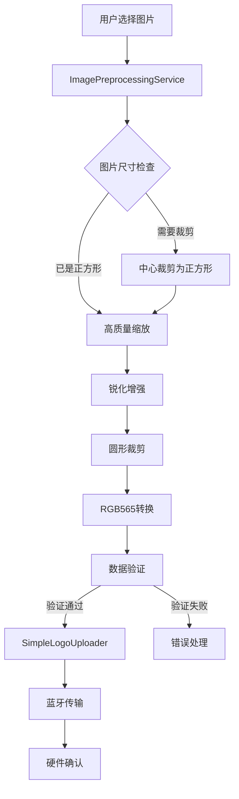
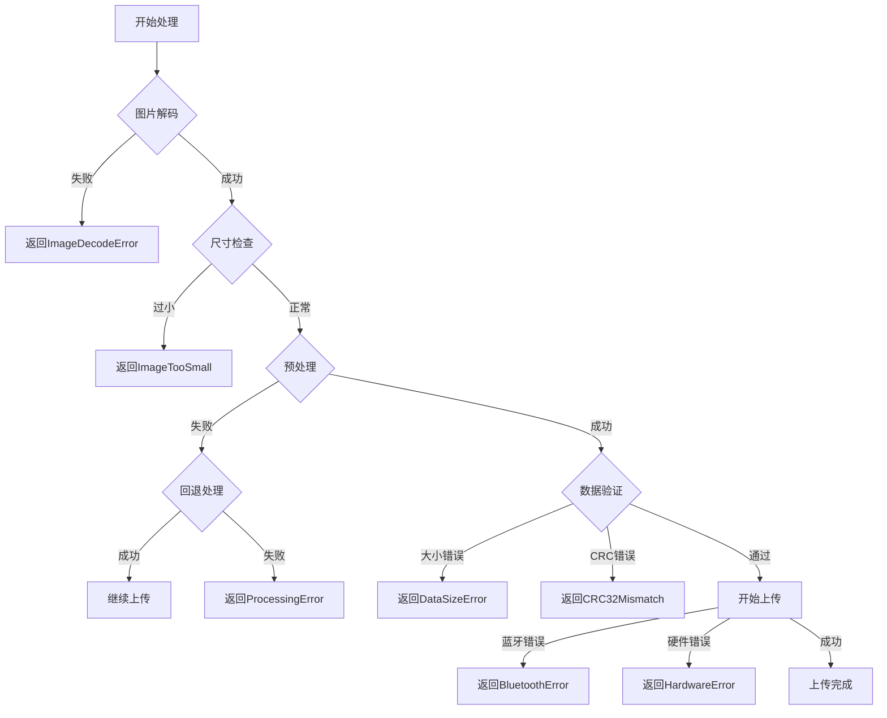

# 设计文档

## 概述

本设计文档描述了图片预处理优化功能的技术实现方案。核心目标是将手机高像素图片处理为240x240圆形格式，使用高质量缩放算法减少模糊，并确保上传到STM32单片机LCD屏幕的可靠性。

设计遵循"最小可行性优先"原则，先实现核心功能验证，再逐步优化。

## 架构



## 组件和接口

### 1. EnhancedImagePreprocessor

增强的图片预处理器，负责高质量图片处理。

```dart
/// 增强的图片预处理器
class EnhancedImagePreprocessor {
  /// 目标尺寸常量
  static const int targetSize = 240;
  
  /// 预处理图片
  /// 
  /// 处理流程:
  /// 1. 加载图片
  /// 2. 中心裁剪为正方形
  /// 3. 高质量缩放到240x240
  /// 4. 可选锐化增强
  /// 5. 圆形裁剪
  /// 6. 转换为RGB565
  Future<ProcessedImageResult> processImage(
    Uint8List imageBytes, {
    bool enableSharpening = true,
    bool enableCircularCrop = true,
  });
  
  /// 中心裁剪为正方形
  img.Image cropToSquare(img.Image image);
  
  /// 高质量缩放
  img.Image highQualityResize(img.Image image, int targetSize);
  
  /// 锐化增强
  img.Image applySharpen(img.Image image, {double strength = 0.3});
  
  /// 圆形裁剪
  img.Image cropToCircle(img.Image image);
  
  /// 转换为RGB565格式
  Uint8List convertToRGB565(img.Image image);
}
```

### 2. ProcessedImageResult

处理结果数据类。

```dart
/// 处理后的图片结果
class ProcessedImageResult {
  /// RGB565格式的图片数据
  final Uint8List rgb565Data;
  
  /// 图片宽度
  final int width;
  
  /// 图片高度
  final int height;
  
  /// CRC32校验和
  final int crc32;
  
  /// 是否为圆形裁剪
  final bool isCircular;
  
  /// 处理时间戳
  final DateTime timestamp;
  
  /// 数据大小（字节）
  int get dataSize => rgb565Data.length;
  
  /// 验证数据大小是否正确
  bool get isValidSize => dataSize == width * height * 2;
}
```

### 3. UploadValidator

上传验证器，确保数据完整性。

```dart
/// 上传验证器
class UploadValidator {
  /// 验证处理结果
  ValidationResult validate(ProcessedImageResult result);
  
  /// 计算CRC32校验和
  int calculateCRC32(Uint8List data);
  
  /// 验证数据大小
  bool validateDataSize(Uint8List data, int expectedSize);
}

/// 验证结果
class ValidationResult {
  final bool isValid;
  final String? errorMessage;
  final int? crc32;
}
```

### 4. E2ETestController

E2E测试控制器，管理测试流程。

```dart
/// E2E测试控制器
class E2ETestController {
  /// 运行完整测试
  Future<TestResult> runFullTest({
    required Uint8List imageBytes,
    required BluetoothProvider btProvider,
    Function(double)? onProgress,
    Function(String)? onLog,
  });
  
  /// 生成测试图片
  Uint8List generateTestImage({
    required TestImageType type,
    int size = 240,
  });
}

/// 测试图片类型
enum TestImageType {
  solidRed,      // 纯红色
  solidGreen,    // 纯绿色
  gradient,      // 渐变色
  checkerboard,  // 棋盘格
}
```

## 数据模型

### RGB565格式说明

```
RGB565格式 (16位/像素):
┌─────────────────────────────────┐
│ R4 R3 R2 R1 R0 G5 G4 G3 G2 G1 G0 B4 B3 B2 B1 B0 │
│ ←── 5位红色 ──→←── 6位绿色 ──→←── 5位蓝色 ──→ │
└─────────────────────────────────┘

存储顺序: 大端序 (MSB First)
- 第1字节: (R4-R0 << 3) | (G5-G3)
- 第2字节: (G2-G0 << 5) | (B4-B0)

240x240图片数据大小: 240 × 240 × 2 = 115,200 字节
```

### 处理流程数据流

```
原始图片 (任意尺寸)
    ↓
正方形裁剪 (min(width, height) × min(width, height))
    ↓
高质量缩放 (240 × 240)
    ↓
锐化增强 (可选)
    ↓
圆形裁剪 (直径240像素)
    ↓
RGB565转换 (115,200字节)
    ↓
CRC32计算
    ↓
蓝牙传输
```


## 正确性属性

*正确性属性是一种在系统所有有效执行中都应保持为真的特征或行为——本质上是关于系统应该做什么的形式化陈述。属性作为人类可读规范和机器可验证正确性保证之间的桥梁。*

### Property 1: 图片尺寸不变性

*对于任意*尺寸的输入图片，经过Image_Preprocessor处理后，输出图片的尺寸应始终为240x240像素。

**Validates: Requirements 1.1, 1.3, 1.4**

### Property 2: 正方形裁剪保持中心

*对于任意*宽高比不为1:1的输入图片，中心裁剪后的图片应为正方形，且裁剪区域应以原图中心为中心。

**Validates: Requirements 1.2**

### Property 3: 圆形裁剪外部背景

*对于任意*经过圆形裁剪的240x240图片，圆形外部（距离中心超过120像素）的所有像素应为黑色（RGB565值为0x0000）。

**Validates: Requirements 2.1, 2.2**

### Property 4: RGB565数据大小不变性

*对于任意*240x240的输入图片，转换为RGB565格式后的数据大小应始终为115200字节（240 × 240 × 2）。

**Validates: Requirements 4.4, 5.1**

### Property 5: RGB565转换往返一致性

*对于任意*RGB颜色值，转换为RGB565格式后再转换回RGB格式，颜色误差应在可接受范围内（每通道误差不超过8）。

**Validates: Requirements 4.1, 4.2**

### Property 6: CRC32计算确定性

*对于任意*相同的输入数据，CRC32计算结果应始终相同；对于不同的输入数据，CRC32结果应不同（碰撞概率极低）。

**Validates: Requirements 5.2**

### Property 7: 数据验证完整性

*对于任意*大小不为115200字节的数据，Upload_Validator应返回验证失败结果。

**Validates: Requirements 5.1, 5.3**

### Property 8: 蓝牙协议格式一致性

*对于任意*上传操作，发送的命令格式应符合现有协议：LOGO_START:size:crc32、LOGO_DATA:seq:hexdata、LOGO_END。

**Validates: Requirements 7.4**

## 错误处理

### 错误类型

| 错误类型 | 描述 | 处理方式 |
|---------|------|---------|
| ImageDecodeError | 图片解码失败 | 返回错误信息，不进行上传 |
| ImageTooSmall | 图片尺寸过小（<10x10） | 返回错误信息，建议选择更大图片 |
| ProcessingError | 处理过程异常 | 尝试回退到原有逻辑 |
| DataSizeError | 数据大小不正确 | 返回错误信息，中止上传 |
| CRC32Mismatch | CRC32校验失败 | 返回错误信息，建议重试 |
| BluetoothError | 蓝牙连接/传输错误 | 返回错误信息，保持现有错误处理 |
| HardwareError | 硬件返回错误 | 解析错误码，返回具体错误信息 |

### 错误处理流程



## 测试策略

### 双重测试方法

本功能采用单元测试和属性测试相结合的方式：

- **单元测试**: 验证特定示例、边界情况和错误条件
- **属性测试**: 验证跨所有输入的通用属性

### 属性测试配置

- 使用 `dart_check` 或 `glados` 库进行属性测试
- 每个属性测试最少运行100次迭代
- 每个测试需标注对应的设计属性

### 测试用例

#### 单元测试

1. **图片尺寸测试**
   - 测试100x100图片缩放到240x240
   - 测试1000x1000图片缩放到240x240
   - 测试非正方形图片（800x600）的裁剪和缩放

2. **圆形裁剪测试**
   - 验证圆形外部像素为黑色
   - 验证圆形内部像素保持原值

3. **RGB565转换测试**
   - 测试纯红色(255,0,0)转换结果
   - 测试纯绿色(0,255,0)转换结果
   - 测试纯蓝色(0,0,255)转换结果

4. **错误处理测试**
   - 测试无效图片数据的处理
   - 测试空数据的处理
   - 测试超大图片的处理

#### 属性测试

1. **Property 1测试**: 生成随机尺寸图片，验证输出尺寸
   - Tag: **Feature: image-preprocessing-optimization, Property 1: 图片尺寸不变性**

2. **Property 4测试**: 生成随机240x240图片，验证RGB565数据大小
   - Tag: **Feature: image-preprocessing-optimization, Property 4: RGB565数据大小不变性**

3. **Property 5测试**: 生成随机RGB颜色，验证往返转换误差
   - Tag: **Feature: image-preprocessing-optimization, Property 5: RGB565转换往返一致性**

4. **Property 6测试**: 生成随机数据，验证CRC32确定性
   - Tag: **Feature: image-preprocessing-optimization, Property 6: CRC32计算确定性**

### E2E测试

1. **基本流程测试**
   - 使用纯色测试图片完成完整上传流程
   - 验证硬件返回LOGO_OK

2. **错误恢复测试**
   - 模拟蓝牙断开，验证错误处理
   - 模拟硬件错误响应，验证错误报告

### 测试优先级

1. **P0 (必须)**: Property 4, Property 7 - 确保数据大小正确，上传不会失败
2. **P1 (重要)**: Property 1, Property 5 - 确保图片处理正确
3. **P2 (一般)**: Property 2, Property 3, Property 6, Property 8 - 其他功能验证
