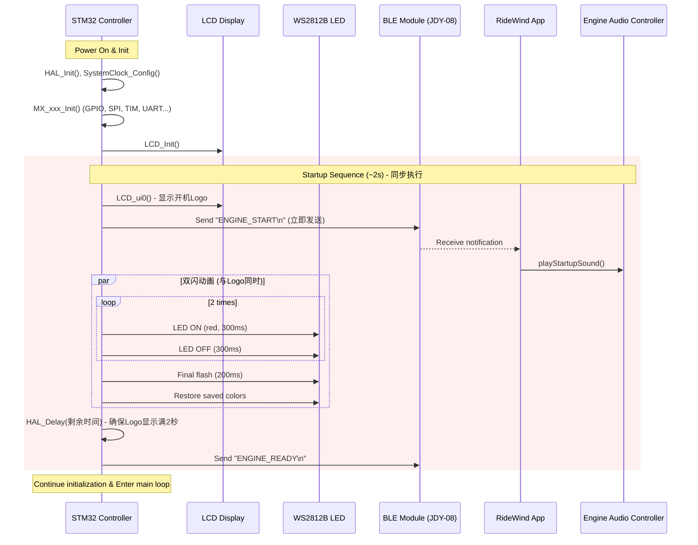

# Design Document: Startup Engine Effect

## Overview

本设计实现硬件开机时的"跑车启动仪式感"效果，在LCD显示开机Logo动画的**同时**，通过STM32控制尾灯双闪，并通过蓝牙通知Flutter APP播放引擎启动声音。设计重点在于：

1. **硬件端（STM32）**：修改开机流程，在`LCD_ui0()`调用时同步触发双闪和蓝牙通知
2. **通信协议**：定义新的蓝牙命令`ENGINE_START`和`ENGINE_READY`
3. **APP端（Flutter）**：扩展`EngineAudioController`支持启动音效播放
4. **同步机制**：确保Logo动画、双闪和引擎声在感知上同步

## Architecture



## Components and Interfaces

### 1. STM32 硬件端组件

#### 1.1 修改 main.c 开机流程

**文件**: `f4_26_1.1/f4_26_1.1/f4_26_1.1/Core/Src/main.c`

**当前流程**:
```c
LCD_Init();
LCD_ui0();  // 显示开机动画
HAL_Delay(2000);  // 显示2秒
// ... 其他初始化 ...
Startup_TaillightFlash();  // 双闪在后面
```

**修改后流程**:
```c
LCD_Init();
LCD_ui0();  // 显示开机动画

// 🆕 立即发送蓝牙通知（与Logo同步）
BLE_SendString("ENGINE_START\n");

// 🆕 执行双闪动画（与Logo同时显示）
Startup_TaillightFlash_NoDelay();  // 无延迟版本，约1.4秒

// 等待剩余时间，确保Logo显示满2秒
HAL_Delay(600);  // 2000 - 1400 = 600ms

// 🆕 发送启动完成通知
BLE_SendString("ENGINE_READY\n");

// ... 继续其他初始化 ...
```

#### 1.2 新增 Startup_TaillightFlash_NoDelay() 函数

**文件**: `f4_26_1.1/f4_26_1.1/f4_26_1.1/Core/Src/main.c`

```c
/**
 * @brief  开机尾灯双闪动画（无延迟版本，与Logo同步）
 * @note   总时长约1.4秒：300*2*2 + 200 = 1400ms
 *         - 慢速闪烁2次（300ms亮 + 300ms灭）
 *         - 最后保持200ms
 *         - 完成后恢复到用户设置的颜色
 */
void Startup_TaillightFlash_NoDelay(void) {
    // 1. 保存LED4当前状态
    extern uint8_t red4, green4, blue4, bright;
    uint8_t saved_red = red4;
    uint8_t saved_green = green4;
    uint8_t saved_blue = blue4;
    uint8_t saved_bright = bright;
    
    // 2. 执行红色双闪（2次）- 无前置延迟
    for(int i = 0; i < 2; i++) {
        WS2812B_SetAllLEDs(4, 255, 0, 0);
        WS2812B_Update(4);
        HAL_Delay(300);
        
        WS2812B_SetAllLEDs(4, 0, 0, 0);
        WS2812B_Update(4);
        HAL_Delay(300);
    }
    
    // 3. 最后一次亮起并保持200ms
    WS2812B_SetAllLEDs(4, 255, 0, 0);
    WS2812B_Update(4);
    HAL_Delay(200);
    
    // 4. 恢复用户设置的颜色
    WS2812B_SetAllLEDs(4, 
        (uint8_t)(saved_red * saved_bright * bright_num),
        (uint8_t)(saved_green * saved_bright * bright_num),
        (uint8_t)(saved_blue * saved_bright * bright_num));
    WS2812B_Update(4);
}
```

#### 1.3 蓝牙发送函数

**文件**: `f4_26_1.1/f4_26_1.1/f4_26_1.1/Core/Src/rx.c`

已存在`BLE_SendString()`函数，无需修改。

### 2. 蓝牙通信协议

#### 2.1 新增命令定义

| 命令 | 方向 | 格式 | 说明 |
|------|------|------|------|
| ENGINE_START | STM32→APP | `ENGINE_START\n` | 通知APP开始播放引擎启动声 |
| ENGINE_READY | STM32→APP | `ENGINE_READY\n` | 通知APP启动序列完成 |

#### 2.2 协议解析扩展

**文件**: `RideWind/lib/services/protocol_service.dart`

```dart
/// 🆕 解析引擎启动通知
/// 响应格式: ENGINE_START 或 ENGINE_READY
String? parseEngineNotification(String response) {
  response = response.trim();
  if (response == 'ENGINE_START' || response == 'ENGINE_READY') {
    return response;
  }
  return null;
}
```

### 3. Flutter APP端组件

#### 3.1 EngineAudioController 扩展

**文件**: `RideWind/lib/services/engine_audio_controller.dart`

```dart
/// 🆕 播放启动引擎声（开机仪式）
/// 播放 engine.mp3 的前几秒作为启动声
Future<void> playStartupSound() async {
  if (!_isInitialized || !_isEnabled) {
    debugPrint('❌ 音效未初始化或已禁用');
    return;
  }
  
  try {
    // 设置启动音量（70%）
    await _audioPlayer.setVolume(0.7);
    
    // 播放启动声（从头开始）
    await _audioPlayer.play(AssetSource('sound/engine.mp3'));
    _isPlaying = true;
    
    debugPrint('🚗 引擎启动声播放中...');
  } catch (e) {
    debugPrint('❌ 播放启动声失败: $e');
  }
}
```

#### 3.2 ProtocolService 事件流扩展

**文件**: `RideWind/lib/services/protocol_service.dart`

```dart
// 🆕 引擎启动通知流控制器
final StreamController<String> _engineNotificationController =
    StreamController<String>.broadcast();

// 🆕 引擎启动通知流
Stream<String> get engineNotificationStream => 
    _engineNotificationController.stream;

/// 🆕 在 _parseProactiveReport 中添加引擎通知解析
void _parseProactiveReport(String response) {
  // ... 现有代码 ...
  
  // 🆕 解析引擎启动通知
  var engineNotification = parseEngineNotification(response);
  if (engineNotification != null) {
    print('🚗 收到引擎通知: $engineNotification');
    _engineNotificationController.add(engineNotification);
    return;
  }
}
```

#### 3.3 设备连接页面集成

**文件**: `RideWind/lib/screens/device_connect_screen.dart`

```dart
// 在连接成功后订阅引擎启动通知
void _subscribeToEngineNotifications() {
  _protocolService.engineNotificationStream.listen((notification) {
    if (notification == 'ENGINE_START') {
      _engineAudioController.playStartupSound();
    } else if (notification == 'ENGINE_READY') {
      debugPrint('🚗 硬件启动序列完成');
    }
  });
}
```

## Data Models

### 启动序列时序（与Logo同步）

| 阶段 | 时间点 | LCD动作 | 硬件动作 | APP动作 |
|------|--------|---------|----------|---------|
| 开始 | 0ms | 显示Logo | 发送ENGINE_START | 开始播放engine.mp3 |
| 闪烁1-亮 | 0-300ms | Logo显示中 | LED红色亮 | 播放中 |
| 闪烁1-灭 | 300-600ms | Logo显示中 | LED熄灭 | 播放中 |
| 闪烁2-亮 | 600-900ms | Logo显示中 | LED红色亮 | 播放中 |
| 闪烁2-灭 | 900-1200ms | Logo显示中 | LED熄灭 | 播放中 |
| 保持 | 1200-1400ms | Logo显示中 | LED红色亮 | 播放中 |
| 恢复 | 1400ms | Logo显示中 | 恢复用户颜色 | 播放中 |
| 等待 | 1400-2000ms | Logo显示中 | 等待 | 播放中 |
| 完成 | 2000ms | Logo结束 | 发送ENGINE_READY | 继续播放或停止 |


## Correctness Properties

*A property is a characteristic or behavior that should hold true across all valid executions of a system—essentially, a formal statement about what the system should do. Properties serve as the bridge between human-readable specifications and machine-verifiable correctness guarantees.*

Based on the prework analysis, the following correctness properties have been identified:

### Property 1: Startup Sequence Triggers Correct Actions (与Logo同步)

*For any* STM32 boot sequence, when `LCD_ui0()` is called to display the boot logo, the system SHALL immediately both send the ENGINE_START notification via BLE AND begin the LED double-flash animation.

**Validates: Requirements 1.1, 2.1, 4.1**

### Property 2: LED Color Restoration (Round-Trip)

*For any* saved LED color configuration (red, green, blue, brightness), after the startup double-flash animation completes, the LED SHALL be restored to the exact same color configuration.

**Validates: Requirements 1.3**

### Property 3: APP Audio Response to ENGINE_START

*For any* ENGINE_START command received by the RideWind_App, the Engine_Audio_Controller SHALL initiate playback of the engine startup sound.

**Validates: Requirements 3.1**

### Property 4: Audio State Transition in Throttle Mode

*For any* engine startup sound completion event while in throttle mode, the Engine_Audio_Controller SHALL transition to playing the idle loop sound (engine_loop.mp3).

**Validates: Requirements 3.3**

### Property 5: Playback Latency Constraint

*For any* ENGINE_START command received by the RideWind_App, the Engine_Audio_Controller SHALL begin playback within 100ms of receiving the command.

**Validates: Requirements 4.3**

### Property 6: Startup Resilience

*For any* failure condition during the startup sequence (BLE failure, connection loss, etc.), the STM32_Controller SHALL complete the double-flash animation and continue to normal operation mode.

**Validates: Requirements 2.3, 5.1, 5.4**

### Property 7: Audio Failure Graceful Degradation

*For any* audio playback failure (missing file, codec error, etc.), the RideWind_App SHALL handle the error gracefully without crashing and log the error for debugging.

**Validates: Requirements 5.2, 5.3**

## Error Handling

### STM32 硬件端错误处理

| 错误场景 | 处理策略 | 恢复动作 |
|----------|----------|----------|
| BLE发送失败 | 忽略错误，继续动画 | 无需恢复 |
| WS2812通信失败 | 跳过当前帧，继续序列 | 下一帧重试 |
| 延时函数异常 | 使用备用计时 | 继续执行 |

### Flutter APP端错误处理

| 错误场景 | 处理策略 | 用户反馈 |
|----------|----------|----------|
| 音频文件缺失 | 跳过播放，记录日志 | 无（静默失败） |
| 播放器初始化失败 | 禁用音效功能 | 无（静默降级） |
| 蓝牙断开 | 停止监听，等待重连 | 无（自动恢复） |
| 音量设置失败 | 使用默认音量 | 无 |

### 错误处理代码示例

**STM32端**:
```c
void Startup_TaillightFlash(void) {
    // ... 保存状态 ...
    
    HAL_Delay(500);
    
    // 🛡️ 错误处理：BLE发送失败不影响动画
    // BLE_SendString 内部已处理超时
    BLE_SendString("ENGINE_START\n");
    
    // 动画执行（无论BLE是否成功）
    for(int i = 0; i < 2; i++) {
        WS2812B_SetAllLEDs(4, 255, 0, 0);
        WS2812B_Update(4);
        HAL_Delay(300);
        
        WS2812B_SetAllLEDs(4, 0, 0, 0);
        WS2812B_Update(4);
        HAL_Delay(300);
    }
    
    // ... 恢复状态 ...
    
    BLE_SendString("ENGINE_READY\n");
}
```

**Flutter端**:
```dart
Future<void> playStartupSound() async {
  if (!_isInitialized || !_isEnabled) {
    debugPrint('⚠️ 音效未初始化，跳过启动声');
    return;
  }
  
  try {
    await _audioPlayer.setVolume(0.7);
    await _audioPlayer.play(AssetSource('sound/engine.mp3'));
    _isPlaying = true;
    debugPrint('🚗 引擎启动声播放中...');
  } catch (e) {
    // 🛡️ 错误处理：播放失败不影响APP运行
    debugPrint('❌ 播放启动声失败（已降级）: $e');
    _isPlaying = false;
  }
}
```

## Testing Strategy

### 测试方法概述

本功能采用双重测试策略：
- **单元测试**: 验证具体示例、边界情况和错误条件
- **属性测试**: 验证跨所有输入的通用属性

### 单元测试（Flutter端）

使用 `flutter_test` 和 `mockito` 进行单元测试：

```dart
// test/services/engine_audio_controller_test.dart

void main() {
  group('EngineAudioController Startup Sound', () {
    test('playStartupSound sets volume to 70%', () async {
      // 验证 Requirements 3.5
      final controller = EngineAudioController();
      await controller.initialize();
      await controller.playStartupSound();
      
      // 验证音量设置
      expect(controller.getCurrentVolume(), closeTo(0.7, 0.01));
    });
    
    test('playStartupSound plays from beginning', () async {
      // 验证 Requirements 3.2
      final controller = EngineAudioController();
      await controller.initialize();
      await controller.playStartupSound();
      
      // 验证播放位置为0
      // (需要mock AudioPlayer)
    });
    
    test('handles missing audio file gracefully', () async {
      // 验证 Requirements 5.3 (edge-case)
      final controller = EngineAudioController();
      // 不初始化，模拟文件缺失
      
      // 不应抛出异常
      expect(() => controller.playStartupSound(), returnsNormally);
    });
  });
}
```

### 属性测试（Flutter端）

使用 `glados` 或 `quickcheck` 风格的属性测试：

```dart
// test/services/engine_audio_controller_property_test.dart

void main() {
  group('Property Tests', () {
    // Feature: startup-engine-effect, Property 2: LED Color Restoration
    test('Property 2: Color restoration round-trip', () {
      // 对于任意颜色配置，保存-动画-恢复后应该相等
      for (var i = 0; i < 100; i++) {
        final r = Random().nextInt(256);
        final g = Random().nextInt(256);
        final b = Random().nextInt(256);
        final brightness = Random().nextInt(101);
        
        final saved = ColorConfig(r, g, b, brightness);
        final restored = simulateStartupAndRestore(saved);
        
        expect(restored, equals(saved));
      }
    });
    
    // Feature: startup-engine-effect, Property 7: Audio Failure Graceful Degradation
    test('Property 7: Audio failures never crash', () {
      // 对于任意错误类型，APP不应崩溃
      final errorTypes = [
        AudioError.fileMissing,
        AudioError.codecError,
        AudioError.permissionDenied,
        AudioError.deviceBusy,
      ];
      
      for (var error in errorTypes) {
        final controller = MockEngineAudioController(throwError: error);
        expect(() => controller.playStartupSound(), returnsNormally);
      }
    });
  });
}
```

### 集成测试

```dart
// integration_test/startup_sequence_test.dart

void main() {
  testWidgets('Startup sequence plays engine sound on ENGINE_START', 
      (tester) async {
    // Feature: startup-engine-effect, Property 3
    
    // 1. 设置mock BLE服务
    final mockBle = MockBLEService();
    
    // 2. 启动APP
    await tester.pumpWidget(MyApp(bleService: mockBle));
    
    // 3. 模拟收到ENGINE_START命令
    mockBle.simulateReceive('ENGINE_START\n');
    await tester.pump(Duration(milliseconds: 100));
    
    // 4. 验证音频开始播放
    expect(find.byType(AudioPlayingIndicator), findsOneWidget);
  });
}
```

### STM32 硬件测试

由于STM32是嵌入式系统，测试策略如下：

1. **代码审查**: 验证`Startup_TaillightFlash()`函数逻辑
2. **串口日志**: 通过UART2输出调试信息验证执行流程
3. **示波器测试**: 验证WS2812时序和BLE发送时序
4. **手动测试**: 实际上电验证双闪效果和APP响应

### 测试配置

- 属性测试最少运行 **100次迭代**
- 每个属性测试必须标注对应的设计文档属性编号
- 标签格式: **Feature: startup-engine-effect, Property {number}: {property_text}**

---

## 4. 硬件端音量调节界面 (UI6)

### 4.1 界面设计

音量调节界面（UI6）模仿亮度调节界面（UI4）的设计：

**布局**:
- 顶部：Voice图标 + "Voice"文字
- 中部：0-100数字显示（使用与亮度相同的数字图片）
- 底部：音量条指示（可选）

**交互**:
- 旋转编码器：调整音量值（0-100）
- 按下编码器：返回菜单

### 4.2 代码实现

#### 4.2.1 新增全局变量

**文件**: `f4_26_1.1/f4_26_1.1/f4_26_1.1/Core/Src/xuanniu.c`

```c
// 🆕 音量控制变量
uint8_t volume = 80;           // 当前音量 (0-100)
uint8_t volume_old = 80;       // 上次音量值（用于检测变化）
```

#### 4.2.2 音量界面初始化函数

**文件**: `f4_26_1.1/f4_26_1.1/f4_26_1.1/Core/Src/lcd.c`

```c
// 音量界面参数（与亮度界面类似）
#define VOLUME_ICON_X       84      // Voice图标X坐标
#define VOLUME_ICON_Y       30      // Voice图标Y坐标
#define VOLUME_NUM_X        ui4_x_qi  // 复用亮度界面的数字位置
#define VOLUME_NUM_Y        ui4_Y_qi

/**
 * @brief  音量调节界面初始化
 */
void LCD_ui6(void)
{
    // 绘制背景
    LCD_ShowPicture(0, 0, LCD_WIDTH, LCD_HEIGHT, gImage_beijing_240_240);
    // 显示Voice图标
    LCD_ShowPicture(VOLUME_ICON_X, VOLUME_ICON_Y, MENU_ICON_VOICE_WIDTH, MENU_ICON_VOICE_HEIGHT, gImage_voicetubiao);
    // 显示"Voice"文字
    uint16_t text_x = (LCD_WIDTH - MENU_TEXT_VOICE_WIDTH) / 2;
    LCD_ShowPicture(text_x, VOLUME_ICON_Y + MENU_ICON_VOICE_HEIGHT + 5, MENU_TEXT_VOICE_WIDTH, MENU_TEXT_VOICE_HEIGHT, gImage_voice);
}

/**
 * @brief  音量数字更新（复用亮度界面的数字显示逻辑）
 */
void LCD_ui6_num_update(u16 num)
{
    // 复用 LCD_ui4_num_update 的逻辑
    LCD_ui4_num_update(num);
}
```

#### 4.2.3 音量调节处理函数

**文件**: `f4_26_1.1/f4_26_1.1/f4_26_1.1/Core/Src/xuanniu.c`

```c
/**
 * @brief  音量调节处理（在UI6界面时调用）
 * @note   模仿 deng_ui4() 亮度调节的逻辑
 */
void volume_ui6(void)
{
    // 使用统一的 encoder_delta
    volume += encoder_delta;
    
    // 限制范围 0-100
    if (volume > 100) {
        volume = 100;
    } else if (volume < 0) {
        volume = 0;
    }
    
    // 更新LCD数字显示
    LCD_ui6_num_update(volume);
    
    // 音量变化时更新VS1003
    if (volume != volume_old) {
        VS1003_SetVolumePercent(volume);
    }
    
    volume_old = volume;
}
```

#### 4.2.4 主循环集成

**文件**: `f4_26_1.1/f4_26_1.1/f4_26_1.1/Core/Src/main.c`

在主循环的界面处理中添加UI6：

```c
// 在 while(1) 主循环中
if (ui == 6) {
    if (chu == 6) {
        LCD_ui6();
        LCD_ui6_num_update(volume);
        chu = 0;
    }
    volume_ui6();
}
```

### 4.3 Flash存储

音量设置需要保存到Flash，开机时恢复：

```c
// 在 deng_init() 中添加音量读取
volume = WriteRead[15];  // 假设使用第16个字节存储音量

// 在 deng_update() 中添加音量保存
WriteRead[15] = volume;
```


---

## 5. 修复长按松手触发单击的Bug

### 5.1 问题分析

**当前问题**：在调速界面（UI1）中，长按编码器按钮开启雾化器后，松手时会误触发单击事件，导致速度单位切换。

**根本原因**：按键释放时没有检查是否已经触发过长按事件，导致长按松手后仍然执行单击逻辑。

### 5.2 修复方案

使用一个标志位 `long_press_triggered` 来跟踪长按是否已触发：

```c
// 按键状态变量
static uint8_t long_press_triggered = 0;  // 🆕 长按已触发标志

// 按键处理逻辑
void Key_Process(void) {
    uint8_t key_now = (HAL_GPIO_ReadPin(ENC_PORT, ENC_KEY_PIN) == 0) ? 1 : 0;
    
    // 按键按下
    if (key_now == 1 && key_old == 0) {
        key_tick = uwTick;
        long_press_triggered = 0;  // 🆕 重置长按标志
    }
    
    // 按键持续按住 - 检测长按
    if (key_now == 1 && key_old == 1) {
        if (!long_press_triggered && (uwTick - key_tick >= 500)) {
            // 🆕 长按触发（仅触发一次）
            long_press_triggered = 1;
            
            // 执行长按动作（开启雾化器）
            if (ui == 1) {
                wuhuaqi_state = 2;  // 进入油门模式
                // ... 其他长按逻辑 ...
            }
        }
    }
    
    // 按键释放
    if (key_now == 0 && key_old == 1) {
        // 🆕 关键修复：只有在没有触发长按的情况下才执行单击
        if (!long_press_triggered) {
            uint32_t press_duration = uwTick - key_tick;
            if (press_duration < 500) {
                // 短按：切换单位
                if (ui == 1) {
                    speed_value = !speed_value;  // 切换 km/h ↔ mph
                    // ... 其他单击逻辑 ...
                }
            }
        }
        
        // 重置状态
        long_press_triggered = 0;
    }
    
    key_old = key_now;
}
```

### 5.3 状态机图

```
     ┌─────────────────────────────────────────────────────────┐
     │                                                         │
     ▼                                                         │
  ┌──────┐    按下     ┌─────────┐                            │
  │ IDLE │ ─────────▶ │ PRESSED │                            │
  └──────┘            └─────────┘                            │
     ▲                     │                                  │
     │                     │                                  │
     │         ┌───────────┴───────────┐                     │
     │         │                       │                     │
     │    <500ms释放              ≥500ms持续按住              │
     │         │                       │                     │
     │         ▼                       ▼                     │
     │   ┌───────────┐         ┌──────────────┐             │
     │   │SHORT_CLICK│         │LONG_PRESS    │             │
     │   │(切换单位) │         │(开启雾化器)  │             │
     │   └───────────┘         │flag=1        │             │
     │         │               └──────────────┘             │
     │         │                       │                     │
     │         │                  释放（忽略单击）            │
     │         │                       │                     │
     └─────────┴───────────────────────┘
```

### 5.4 关键点

1. **按下时重置标志**：`long_press_triggered = 0`
2. **长按时设置标志**：当按住超过500ms时，`long_press_triggered = 1`
3. **释放时检查标志**：只有 `long_press_triggered == 0` 时才执行单击逻辑
4. **长按只触发一次**：使用标志位防止长按期间重复触发


---

## 6. 油门模式数字跳跃动画效果

### 6.1 效果描述

当油门模式下速度数字变化时，数字应该有一个"跳跃"的视觉效果，增加冲击力和动感。

### 6.2 实现方案

由于STM32的LCD显示能力有限，我们采用以下方案实现跳跃效果：

**方案A：位置偏移动画（推荐）**
```c
/**
 * @brief  带跳跃效果的速度数字更新
 * @param  speed: 当前速度值
 * @param  old_speed: 上次速度值
 */
void LCD_Speed_Update_Animated(int16_t speed, int16_t old_speed) {
    int16_t delta = speed - old_speed;
    
    if (delta == 0) return;
    
    // 计算跳跃偏移量（速度变化越大，跳跃越明显）
    int8_t jump_offset = 0;
    if (abs(delta) >= 10) {
        jump_offset = 8;  // 大变化：跳跃8像素
    } else if (abs(delta) >= 5) {
        jump_offset = 5;  // 中等变化：跳跃5像素
    } else {
        jump_offset = 3;  // 小变化：跳跃3像素
    }
    
    // 第1帧：数字向上跳跃
    LCD_Fill(speed_area);  // 清除旧数字
    LCD_ShowSpeed(x, y - jump_offset, speed);  // 向上偏移显示
    HAL_Delay(50);
    
    // 第2帧：数字回到原位
    LCD_Fill(speed_area);
    LCD_ShowSpeed(x, y, speed);  // 正常位置显示
}
```

**方案B：闪烁强调效果**
```c
/**
 * @brief  带闪烁效果的速度数字更新
 */
void LCD_Speed_Update_Flash(int16_t speed, int16_t old_speed) {
    if (speed == old_speed) return;
    
    // 第1帧：高亮颜色显示
    LCD_ShowSpeed_Color(x, y, speed, YELLOW);  // 黄色高亮
    HAL_Delay(80);
    
    // 第2帧：恢复正常颜色
    LCD_ShowSpeed_Color(x, y, speed, WHITE);   // 白色正常
}
```

### 6.3 集成位置

在油门模式的速度更新逻辑中调用动画函数：

```c
// 在油门模式处理中
if (wuhuaqi_state == 2) {
    // ... 速度计算逻辑 ...
    
    if (current_speed != last_speed) {
        // 🆕 使用带动画的更新函数
        LCD_Speed_Update_Animated(current_speed, last_speed);
        last_speed = current_speed;
    }
}
```

---

## 7. 修复油门模式旋转退出Bug

### 7.1 问题分析

**当前问题**：三击进入油门模式后，旋转编码器会：
1. 退出油门模式
2. 错误地切换到菜单界面（UI5）
3. 同时切换到颜色预设界面

**根本原因**：油门模式下的编码器旋转处理逻辑没有正确隔离，导致：
- 旋转被同时处理为"退出油门模式"和"菜单切换"
- `ui` 变量被错误修改为 5（菜单）
- `menu_selected` 被错误修改

### 7.2 修复方案

**关键修复**：在油门模式下，编码器旋转只应该退出油门模式并返回UI1，不应该触发菜单切换。

```c
// 在 Encoder() 函数中

// ✅ 菜单界面的编码器处理 (ui=5)
// 🔧 修复：只有在非油门模式时才处理菜单切换
if (ui == 5 && wuhuaqi_state != 2) {
    // 菜单切换逻辑...
}

// 油门模式处理
if (wuhuaqi_state == 2) {
    int16_t delta = encoder_delta;
    
    if (delta != 0) {
        // 旋转编码器退出油门模式
        wuhuaqi_state = wuhuaqi_state_saved;
        wuhuaqi_state_old = wuhuaqi_state;
        throttle_initialized = 0;
        
        // 🔧 关键修复：确保停留在UI1，不切换到菜单
        ui = 1;  // 强制保持在调速界面
        // 不修改 menu_selected
        
        // 停止引擎音效
        EngineAudio_Stop();
        
        return;  // 🔧 立即返回，不执行后续的菜单切换逻辑
    }
}
```

### 7.3 状态隔离

确保油门模式下的状态完全隔离：

```c
// 进入油门模式时保存状态
if (entering_throttle_mode) {
    saved_ui = ui;  // 保存当前界面（应该是1）
    saved_menu_selected = menu_selected;  // 保存菜单选择
}

// 退出油门模式时恢复状态
if (exiting_throttle_mode) {
    ui = saved_ui;  // 恢复到UI1
    // menu_selected 保持不变
}
```

### 7.4 关键检查点

1. **进入油门模式**：只能从UI1进入
2. **油门模式中**：`ui` 保持为1，`menu_selected` 不变
3. **退出油门模式**：返回UI1，不触发菜单切换
4. **编码器处理顺序**：先检查油门模式，处理完后立即返回


---

## 8. 流水灯平滑渐变过渡效果

### 8.1 问题分析

**当前问题**：APP发送流水灯指令时，LED颜色变化是"一闪一闪"的跳变，缺乏高端感。

**期望效果**：像电脑机箱RGB灯或音响灯光那样，颜色过渡丝滑流畅，肉眼几乎看不出变化过程。

### 8.2 技术方案

#### 8.2.1 核心算法：线性插值渐变

```c
// 渐变状态结构体
typedef struct {
    uint8_t current_r, current_g, current_b;   // 当前颜色
    uint8_t target_r, target_g, target_b;      // 目标颜色
    uint16_t frames_total;                      // 总帧数
    uint16_t frames_remaining;                  // 剩余帧数
    uint8_t active;                             // 是否正在渐变
} LED_Gradient_t;

// 三组LED的渐变状态
static LED_Gradient_t led_gradient[3];  // LED1, LED2, LED3

/**
 * @brief  启动颜色渐变
 * @param  led_index: LED索引 (0=左, 1=中, 2=右)
 * @param  r, g, b: 目标颜色
 * @param  duration_ms: 过渡时间（毫秒）
 */
void LED_StartGradient(uint8_t led_index, uint8_t r, uint8_t g, uint8_t b, uint16_t duration_ms) {
    LED_Gradient_t* grad = &led_gradient[led_index];
    
    // 保存当前颜色作为起点
    // (从全局变量读取当前颜色)
    
    // 设置目标颜色
    grad->target_r = r;
    grad->target_g = g;
    grad->target_b = b;
    
    // 计算帧数 (50fps = 20ms/帧)
    grad->frames_total = duration_ms / 20;
    grad->frames_remaining = grad->frames_total;
    grad->active = 1;
}

/**
 * @brief  渐变处理（在主循环中每20ms调用一次）
 */
void LED_GradientProcess(void) {
    static uint32_t last_tick = 0;
    
    // 50fps刷新率控制
    if (uwTick - last_tick < 20) return;
    last_tick = uwTick;
    
    for (int i = 0; i < 3; i++) {
        LED_Gradient_t* grad = &led_gradient[i];
        
        if (!grad->active || grad->frames_remaining == 0) continue;
        
        // 线性插值计算当前帧颜色
        float progress = 1.0f - (float)grad->frames_remaining / grad->frames_total;
        
        uint8_t r = grad->current_r + (grad->target_r - grad->current_r) * progress;
        uint8_t g = grad->current_g + (grad->target_g - grad->current_g) * progress;
        uint8_t b = grad->current_b + (grad->target_b - grad->current_b) * progress;
        
        // 更新LED
        WS2812B_SetAllLEDs(i + 1, r * bright * bright_num, 
                                  g * bright * bright_num, 
                                  b * bright * bright_num);
        
        grad->frames_remaining--;
        
        // 渐变完成
        if (grad->frames_remaining == 0) {
            grad->current_r = grad->target_r;
            grad->current_g = grad->target_g;
            grad->current_b = grad->target_b;
            grad->active = 0;
        }
    }
    
    // 批量更新所有LED
    WS2812B_Update(3);
}
```

#### 8.2.2 速度模式参数

| 模式 | 过渡时间 | 帧数(50fps) | 每帧RGB变化 |
|------|----------|-------------|-------------|
| 快速 | 500ms | 25帧 | ~10单位/帧 |
| 正常 | 1500ms | 75帧 | ~3单位/帧 |
| 慢速 | 3000ms | 150帧 | ~1.7单位/帧 |

#### 8.2.3 APP指令扩展

```
// 现有指令格式（假设）
STREAM:speed:r1:g1:b1:r2:g2:b2:r3:g3:b3

// speed参数：
// 1 = 快速 (500ms)
// 2 = 正常 (1500ms)
// 3 = 慢速 (3000ms)
```

### 8.3 集成方式

1. **主循环调用**：在 `while(1)` 中添加 `LED_GradientProcess()` 调用
2. **蓝牙指令处理**：收到流水灯指令时调用 `LED_StartGradient()` 而不是直接设置颜色
3. **与其他功能兼容**：渐变过程中如果收到新指令，立即切换到新目标（平滑衔接）

### 8.4 优化技巧

1. **使用整数运算**：避免浮点数，用定点数加速计算
2. **批量更新**：三组LED计算完后一次性调用 `WS2812B_Update()`
3. **非阻塞设计**：渐变在主循环中分帧执行，不阻塞其他功能

```c
// 整数版本的线性插值（避免浮点运算）
uint8_t lerp_u8(uint8_t start, uint8_t end, uint16_t current_frame, uint16_t total_frames) {
    int32_t delta = (int32_t)(end - start) * current_frame / total_frames;
    return start + delta;
}
```
