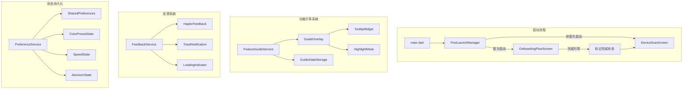
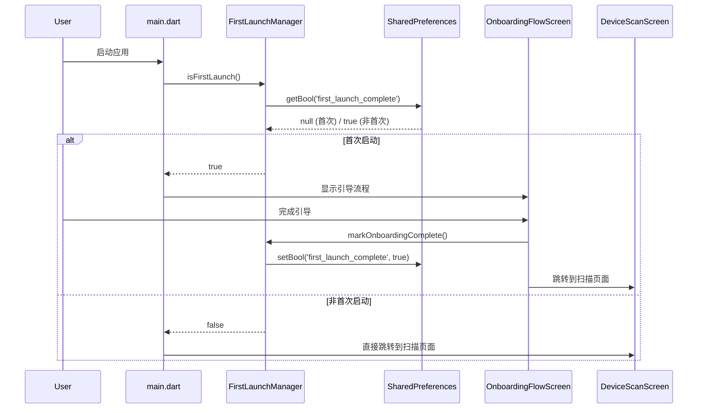
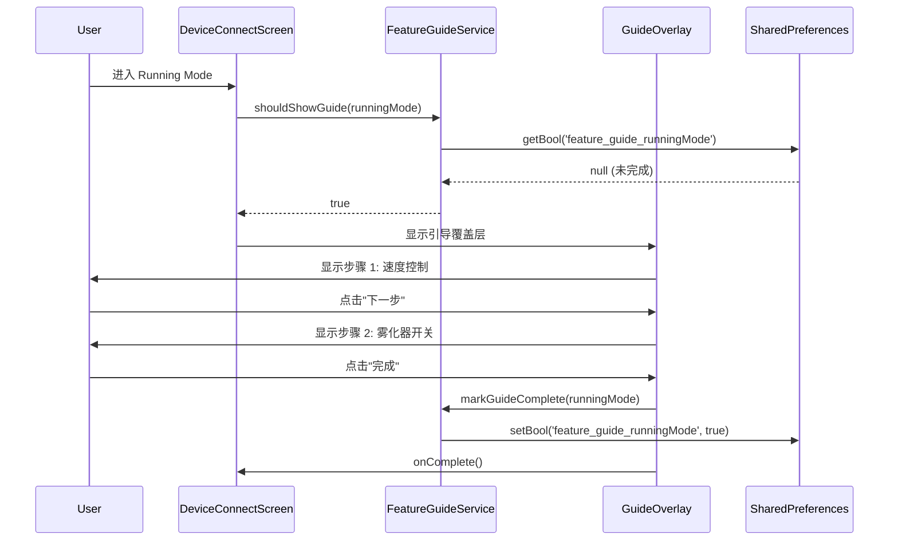

# Design Document: UX Experience Optimization

## Overview

本设计文档描述 RideWind 应用操作体验优化的技术实现方案。主要包含三个核心模块：
1. **首次启动管理** - 使用 SharedPreferences 检测和记录首次启动状态
2. **功能引导系统** - 基于 Overlay 的新手引导组件
3. **交互反馈增强** - 统一的反馈机制和状态管理

## Architecture



## Components and Interfaces

### 1. FirstLaunchManager - 首次启动管理器

```dart
/// 首次启动管理器
/// 负责检测和管理应用的首次启动状态
class FirstLaunchManager {
  static const String _keyFirstLaunchComplete = 'first_launch_complete';
  static const String _keyOnboardingVersion = 'onboarding_version';
  static const int _currentOnboardingVersion = 1;
  
  /// 检查是否为首次启动
  /// 返回 true 表示需要显示引导流程
  Future<bool> isFirstLaunch() async {
    final prefs = await SharedPreferences.getInstance();
    final completed = prefs.getBool(_keyFirstLaunchComplete) ?? false;
    final version = prefs.getInt(_keyOnboardingVersion) ?? 0;
    
    // 如果未完成或版本更新，需要显示引导
    return !completed || version < _currentOnboardingVersion;
  }
  
  /// 标记引导流程已完成
  Future<void> markOnboardingComplete() async {
    final prefs = await SharedPreferences.getInstance();
    await prefs.setBool(_keyFirstLaunchComplete, true);
    await prefs.setInt(_keyOnboardingVersion, _currentOnboardingVersion);
  }
  
  /// 重置首次启动状态（用于测试）
  Future<void> reset() async {
    final prefs = await SharedPreferences.getInstance();
    await prefs.remove(_keyFirstLaunchComplete);
    await prefs.remove(_keyOnboardingVersion);
  }
}
```

### 2. FeatureGuideService - 功能引导服务

```dart
/// 功能引导服务
/// 管理各功能模块的新手引导状态和显示逻辑
class FeatureGuideService {
  static const String _keyPrefix = 'feature_guide_';
  
  /// 功能引导类型枚举
  enum GuideType {
    runningMode,    // Running Mode 操作引导
    colorizeMode,   // Colorize Mode 操作引导
    logoUpload,     // Logo 上传引导
    deviceConnect,  // 设备连接引导
  }
  
  /// 检查指定功能是否需要显示引导
  Future<bool> shouldShowGuide(GuideType type) async {
    final prefs = await SharedPreferences.getInstance();
    return !(prefs.getBool('$_keyPrefix${type.name}') ?? false);
  }
  
  /// 标记指定功能的引导已完成
  Future<void> markGuideComplete(GuideType type) async {
    final prefs = await SharedPreferences.getInstance();
    await prefs.setBool('$_keyPrefix${type.name}', true);
  }
  
  /// 重置所有功能引导状态
  Future<void> resetAllGuides() async {
    final prefs = await SharedPreferences.getInstance();
    for (final type in GuideType.values) {
      await prefs.remove('$_keyPrefix${type.name}');
    }
  }
}
```

### 3. GuideOverlay - 引导覆盖层组件

```dart
/// 引导覆盖层组件
/// 用于显示功能操作提示，支持高亮目标元素
class GuideOverlay extends StatefulWidget {
  final List<GuideStep> steps;
  final VoidCallback onComplete;
  final VoidCallback? onSkip;
  
  const GuideOverlay({
    required this.steps,
    required this.onComplete,
    this.onSkip,
  });
}

/// 引导步骤定义
class GuideStep {
  final GlobalKey targetKey;      // 目标元素的 GlobalKey
  final String title;             // 步骤标题
  final String description;       // 步骤描述
  final TooltipPosition position; // 提示框位置
  final IconData? icon;           // 可选图标
  
  const GuideStep({
    required this.targetKey,
    required this.title,
    required this.description,
    this.position = TooltipPosition.bottom,
    this.icon,
  });
}

enum TooltipPosition { top, bottom, left, right }
```

### 4. FeedbackService - 反馈服务

```dart
/// 统一反馈服务
/// 提供触觉反馈、Toast 通知、加载状态管理
class FeedbackService {
  /// 触觉反馈类型
  static Future<void> haptic(HapticType type) async {
    switch (type) {
      case HapticType.light:
        await HapticFeedback.lightImpact();
        break;
      case HapticType.medium:
        await HapticFeedback.mediumImpact();
        break;
      case HapticType.heavy:
        await HapticFeedback.heavyImpact();
        break;
      case HapticType.selection:
        await HapticFeedback.selectionClick();
        break;
    }
  }
  
  /// 显示成功提示
  static void showSuccess(BuildContext context, String message) {
    _showToast(context, message, Colors.green, Icons.check_circle);
  }
  
  /// 显示错误提示
  static void showError(BuildContext context, String message, {VoidCallback? onRetry}) {
    _showToast(context, message, Colors.red, Icons.error, onRetry: onRetry);
  }
  
  /// 显示加载指示器
  static OverlayEntry showLoading(BuildContext context, {String? message}) {
    // 返回 OverlayEntry 以便后续移除
  }
}

enum HapticType { light, medium, heavy, selection }
```

### 5. PreferenceService - 偏好存储服务

```dart
/// 用户偏好存储服务
/// 管理用户设置的持久化存储和恢复
class PreferenceService {
  static const String _keyColorPreset = 'last_color_preset';
  static const String _keySpeedValue = 'last_speed_value';
  static const String _keyAtomizerState = 'last_atomizer_state';
  static const String _keyDeviceSettings = 'device_settings_';
  
  /// 保存颜色预设索引
  Future<void> saveColorPreset(int index) async {
    final prefs = await SharedPreferences.getInstance();
    await prefs.setInt(_keyColorPreset, index);
  }
  
  /// 获取上次的颜色预设索引
  Future<int> getColorPreset() async {
    final prefs = await SharedPreferences.getInstance();
    return prefs.getInt(_keyColorPreset) ?? 0;
  }
  
  /// 保存速度值
  Future<void> saveSpeedValue(int speed) async {
    final prefs = await SharedPreferences.getInstance();
    await prefs.setInt(_keySpeedValue, speed);
  }
  
  /// 获取上次的速度值
  Future<int> getSpeedValue() async {
    final prefs = await SharedPreferences.getInstance();
    return prefs.getInt(_keySpeedValue) ?? 0;
  }
  
  /// 保存雾化器状态
  Future<void> saveAtomizerState(bool isOn) async {
    final prefs = await SharedPreferences.getInstance();
    await prefs.setBool(_keyAtomizerState, isOn);
  }
  
  /// 获取上次的雾化器状态
  Future<bool> getAtomizerState() async {
    final prefs = await SharedPreferences.getInstance();
    return prefs.getBool(_keyAtomizerState) ?? false;
  }
  
  /// 保存设备特定设置
  Future<void> saveDeviceSettings(String deviceId, Map<String, dynamic> settings) async {
    final prefs = await SharedPreferences.getInstance();
    await prefs.setString('$_keyDeviceSettings$deviceId', jsonEncode(settings));
  }
  
  /// 获取设备特定设置
  Future<Map<String, dynamic>?> getDeviceSettings(String deviceId) async {
    final prefs = await SharedPreferences.getInstance();
    final json = prefs.getString('$_keyDeviceSettings$deviceId');
    if (json != null) {
      return jsonDecode(json) as Map<String, dynamic>;
    }
    return null;
  }
}
```

## Data Models

### GuideConfiguration - 引导配置模型

```dart
/// 功能引导配置
class GuideConfiguration {
  final String featureId;
  final List<GuideStep> steps;
  final bool canSkip;
  final Duration stepDelay;
  
  const GuideConfiguration({
    required this.featureId,
    required this.steps,
    this.canSkip = true,
    this.stepDelay = const Duration(milliseconds: 300),
  });
}

/// Running Mode 引导配置
final runningModeGuide = GuideConfiguration(
  featureId: 'running_mode',
  steps: [
    GuideStep(
      targetKey: speedControlKey,
      title: '速度控制',
      description: '上下滑动调节速度，数值会实时同步到设备',
      icon: Icons.swap_vert,
    ),
    GuideStep(
      targetKey: atomizerButtonKey,
      title: '雾化器开关',
      description: '双击此区域可快速切换雾化器开关状态',
      icon: Icons.touch_app,
    ),
    GuideStep(
      targetKey: maxSpeedKey,
      title: '最大速度',
      description: '点击设置最大速度限制',
      icon: Icons.speed,
    ),
  ],
);

/// Colorize Mode 引导配置
final colorizeModeGuide = GuideConfiguration(
  featureId: 'colorize_mode',
  steps: [
    GuideStep(
      targetKey: colorPresetsKey,
      title: '颜色预设',
      description: '左右滑动选择预设颜色方案',
      icon: Icons.swipe,
    ),
    GuideStep(
      targetKey: rgbDetailKey,
      title: '详细调色',
      description: '长按预设进入 RGB 详细调色模式',
      icon: Icons.palette,
    ),
    GuideStep(
      targetKey: brightnessKey,
      title: '亮度调节',
      description: '拖动滑块调节整体亮度',
      icon: Icons.brightness_6,
    ),
  ],
);
```

### FeedbackState - 反馈状态模型

```dart
/// 操作反馈状态
class FeedbackState {
  final bool isLoading;
  final String? loadingMessage;
  final String? errorMessage;
  final String? successMessage;
  final DateTime? lastFeedbackTime;
  
  const FeedbackState({
    this.isLoading = false,
    this.loadingMessage,
    this.errorMessage,
    this.successMessage,
    this.lastFeedbackTime,
  });
  
  FeedbackState copyWith({
    bool? isLoading,
    String? loadingMessage,
    String? errorMessage,
    String? successMessage,
    DateTime? lastFeedbackTime,
  }) {
    return FeedbackState(
      isLoading: isLoading ?? this.isLoading,
      loadingMessage: loadingMessage ?? this.loadingMessage,
      errorMessage: errorMessage ?? this.errorMessage,
      successMessage: successMessage ?? this.successMessage,
      lastFeedbackTime: lastFeedbackTime ?? this.lastFeedbackTime,
    );
  }
}
```

## Sequence Diagrams

### 首次启动流程



### 功能引导流程




## Correctness Properties

*A property is a characteristic or behavior that should hold true across all valid executions of a system—essentially, a formal statement about what the system should do. Properties serve as the bridge between human-readable specifications and machine-verifiable correctness guarantees.*

### Property 1: First Launch State Round-Trip

*For any* application state, if `markOnboardingComplete()` is called, then `isFirstLaunch()` should return `false`. Conversely, after `reset()` is called, `isFirstLaunch()` should return `true`.

**Validates: Requirements 1.1, 1.2, 1.4**

### Property 2: Feature Guide State Round-Trip

*For any* `GuideType` value, if `markGuideComplete(type)` is called, then `shouldShowGuide(type)` should return `false`. Before any completion is marked, `shouldShowGuide(type)` should return `true`.

**Validates: Requirements 3.1, 3.2, 3.3, 3.5**

### Property 3: Preference Storage Round-Trip

*For any* valid preference value (color preset index 0-11, speed value 0-340, atomizer state true/false), saving the value and then retrieving it should return the same value.

**Validates: Requirements 9.1, 9.2, 9.3**

### Property 4: Device Settings Round-Trip

*For any* device ID and valid settings map, calling `saveDeviceSettings(deviceId, settings)` followed by `getDeviceSettings(deviceId)` should return an equivalent settings map.

**Validates: Requirements 9.5**

### Property 5: Touch Target Size Compliance

*For any* interactive widget in the application, its touch target size should be at least 44x44 logical pixels.

**Validates: Requirements 8.2**

### Property 6: Color Contrast Compliance

*For any* text-background color pair in the application, the contrast ratio should be at least 4.5:1 for normal text.

**Validates: Requirements 8.3**

## Error Handling

### 1. SharedPreferences 异常处理

```dart
/// 安全的偏好读取，出错时返回默认值
Future<T> safeGetPreference<T>(String key, T defaultValue) async {
  try {
    final prefs = await SharedPreferences.getInstance();
    final value = prefs.get(key);
    if (value is T) return value;
    return defaultValue;
  } catch (e) {
    debugPrint('Error reading preference $key: $e');
    return defaultValue;
  }
}

/// 安全的偏好写入，出错时静默失败并记录日志
Future<bool> safeSetPreference<T>(String key, T value) async {
  try {
    final prefs = await SharedPreferences.getInstance();
    if (value is bool) {
      return await prefs.setBool(key, value);
    } else if (value is int) {
      return await prefs.setInt(key, value);
    } else if (value is double) {
      return await prefs.setDouble(key, value);
    } else if (value is String) {
      return await prefs.setString(key, value);
    }
    return false;
  } catch (e) {
    debugPrint('Error writing preference $key: $e');
    return false;
  }
}
```

### 2. 引导覆盖层异常处理

```dart
/// 安全显示引导覆盖层
/// 如果目标元素不存在或位置计算失败，跳过该步骤
void showGuideStep(GuideStep step) {
  try {
    final renderBox = step.targetKey.currentContext?.findRenderObject() as RenderBox?;
    if (renderBox == null) {
      debugPrint('Target element not found for step: ${step.title}');
      _skipToNextStep();
      return;
    }
    
    final position = renderBox.localToGlobal(Offset.zero);
    final size = renderBox.size;
    
    // 显示高亮和提示
    _showHighlight(position, size);
    _showTooltip(step, position, size);
  } catch (e) {
    debugPrint('Error showing guide step: $e');
    _skipToNextStep();
  }
}
```

### 3. 反馈服务异常处理

```dart
/// 安全的触觉反馈
/// 如果设备不支持或出错，静默失败
static Future<void> safeHaptic(HapticType type) async {
  try {
    await haptic(type);
  } catch (e) {
    // 触觉反馈失败不影响用户操作
    debugPrint('Haptic feedback failed: $e');
  }
}
```

## Testing Strategy

### 单元测试

单元测试用于验证具体示例和边界情况：

1. **FirstLaunchManager 测试**
   - 测试首次启动时 `isFirstLaunch()` 返回 `true`
   - 测试完成引导后 `isFirstLaunch()` 返回 `false`
   - 测试重置后 `isFirstLaunch()` 返回 `true`
   - 测试版本升级时的行为

2. **FeatureGuideService 测试**
   - 测试各功能类型的初始状态
   - 测试完成标记后的状态变化
   - 测试重置所有引导的功能

3. **PreferenceService 测试**
   - 测试颜色预设的边界值（0, 11）
   - 测试速度值的边界值（0, 340）
   - 测试雾化器状态的布尔值
   - 测试设备设置的 JSON 序列化

### 属性测试

属性测试用于验证通用属性在所有有效输入上成立：

1. **Property 1: First Launch State Round-Trip**
   - 使用 `flutter_test` 的 property-based testing
   - 最少 100 次迭代
   - Tag: **Feature: ux-experience-optimization, Property 1: First Launch State Round-Trip**

2. **Property 2: Feature Guide State Round-Trip**
   - 对所有 `GuideType` 枚举值进行测试
   - 最少 100 次迭代
   - Tag: **Feature: ux-experience-optimization, Property 2: Feature Guide State Round-Trip**

3. **Property 3: Preference Storage Round-Trip**
   - 生成随机的颜色预设索引（0-11）、速度值（0-340）、布尔状态
   - 最少 100 次迭代
   - Tag: **Feature: ux-experience-optimization, Property 3: Preference Storage Round-Trip**

4. **Property 4: Device Settings Round-Trip**
   - 生成随机的设备 ID 和设置 Map
   - 最少 100 次迭代
   - Tag: **Feature: ux-experience-optimization, Property 4: Device Settings Round-Trip**

### Widget 测试

Widget 测试用于验证 UI 组件的行为：

1. **GuideOverlay 测试**
   - 测试步骤导航（下一步、跳过）
   - 测试高亮遮罩的正确位置
   - 测试提示框的正确显示

2. **FeedbackService 测试**
   - 测试 Toast 通知的显示和消失
   - 测试加载指示器的显示和移除

### 测试框架配置

```yaml
# pubspec.yaml
dev_dependencies:
  flutter_test:
    sdk: flutter
  mockito: ^5.4.0
  shared_preferences_mock: ^2.0.0
```

```dart
// test/services/first_launch_manager_test.dart
import 'package:flutter_test/flutter_test.dart';
import 'package:shared_preferences/shared_preferences.dart';

void main() {
  group('FirstLaunchManager', () {
    setUp(() {
      SharedPreferences.setMockInitialValues({});
    });

    // Property 1: First Launch State Round-Trip
    // Feature: ux-experience-optimization, Property 1: First Launch State Round-Trip
    test('round-trip: mark complete then check returns false', () async {
      final manager = FirstLaunchManager();
      
      // 初始状态应该是首次启动
      expect(await manager.isFirstLaunch(), true);
      
      // 标记完成
      await manager.markOnboardingComplete();
      
      // 应该不再是首次启动
      expect(await manager.isFirstLaunch(), false);
    });

    test('round-trip: reset then check returns true', () async {
      final manager = FirstLaunchManager();
      
      // 先标记完成
      await manager.markOnboardingComplete();
      expect(await manager.isFirstLaunch(), false);
      
      // 重置
      await manager.reset();
      
      // 应该恢复为首次启动
      expect(await manager.isFirstLaunch(), true);
    });
  });
}
```
