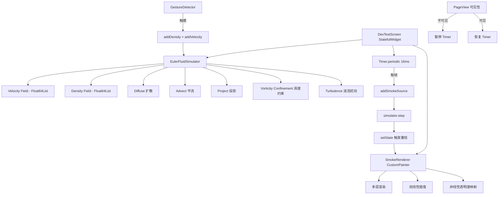

# 设计文档：逼真烟雾效果

## 概述

本设计对 RideWind APP 的 DevTestScreen 烟雾效果进行全面升级。核心改进包括：

1. **烟雾方向**：从"自下而上"改为"从左至右"
2. **物理增强**：引入涡度约束（Vorticity Confinement）和时变湍流扰动
3. **渲染升级**：多层渲染 + 双线性插值 + 非线性透明度映射，消除方块感
4. **边界条件**：左侧开放入流、右侧开放出流，烟雾自然流出屏幕
5. **性能保障**：PageView 可见性感知，不可见时暂停模拟

整体架构保持现有的 `EulerFluidSimulator` + `DevTestScreen` + `CustomPainter` 三层结构，在此基础上增强各层能力。

## 架构



### 数据流

1. Timer 每 16ms 触发一次循环
2. 在左侧边缘注入烟雾密度和向右速度
3. Fluid_Simulator 执行一步模拟（扩散→投影→平流→投影→涡度约束→湍流→衰减）
4. setState 触发 CustomPainter 重绘
5. SmokeRenderer 读取密度场，通过多层渲染输出画面

## 组件与接口

### 1. EulerFluidSimulator（增强）

现有模拟器增加以下能力：

```dart
class EulerFluidSimulator {
  // 现有接口保持不变
  void addDensity(int x, int y, double amount);
  void addVelocity(int x, int y, double amountX, double amountY);
  void step();
  double getDensity(int x, int y);
  (double, double) getVelocity(int x, int y);
  void reset();
  
  // 新增：涡度约束
  double vorticityStrength; // 涡度约束强度，默认 0.1
  void _applyVorticityConfinement(); // 在 step() 中调用
  
  // 新增：开放边界条件
  void _setOpenBoundary(int b, Float64List x); // 替代左右边界的反射条件
  
  // 新增：密度阈值清零
  double densityThreshold; // 默认 0.005
  void _cleanupLowDensity(); // 在 step() 末尾调用
}
```

#### 涡度约束算法

涡度约束是补偿数值耗散的关键技术。算法步骤：

1. 计算每个网格的涡度 ω = ∂v/∂x - ∂u/∂y
2. 计算涡度梯度方向 N = ∇|ω| / |∇|ω||
3. 施加约束力 f = ε × h × (N × ω)，其中 ε 为约束强度

```dart
void _applyVorticityConfinement() {
  // 1. 计算涡度场 curl
  for each interior cell (i, j):
    curl[i,j] = (v[i+1,j] - v[i-1,j]) - (u[i,j+1] - u[i,j-1]) * 0.5
  
  // 2. 计算涡度梯度并施加约束力
  for each interior cell (i, j):
    dw_dx = (|curl[i+1,j]| - |curl[i-1,j]|) * 0.5
    dw_dy = (|curl[i,j+1]| - |curl[i,j-1]|) * 0.5
    len = sqrt(dw_dx² + dw_dy²) + 1e-5
    dw_dx /= len
    dw_dy /= len
    
    u[i,j] += vorticityStrength * (dw_dy * curl[i,j])
    v[i,j] -= vorticityStrength * (dw_dx * curl[i,j])
}
```

#### 开放边界条件

```dart
void _setOpenBoundary(int b, Float64List x) {
  // 左侧：入流边界（密度从源注入，速度保持正向）
  for j in 1..gridHeight-2:
    x[idx(0, j)] = x[idx(1, j)]  // Neumann 条件
  
  // 右侧：出流边界（允许自由流出）
  for j in 1..gridHeight-2:
    x[idx(gridWidth-1, j)] = x[idx(gridWidth-2, j)]  // Neumann 条件
  
  // 上下边界：保持现有反射条件
  // 对于速度 v 分量，上下边界取反
}
```

#### 修改后的 step() 流程

```dart
void step() {
  // 1. 速度场扩散
  _diffuse(1, _uPrev, _u, viscosity);
  _diffuse(2, _vPrev, _v, viscosity);
  _project(_uPrev, _vPrev, _u, _v);
  
  // 2. 速度场平流
  _advect(1, _u, _uPrev, _uPrev, _vPrev);
  _advect(2, _v, _vPrev, _uPrev, _vPrev);
  _project(_u, _v, _uPrev, _vPrev);
  
  // 3. 涡度约束（新增）
  _applyVorticityConfinement();
  
  // 4. 湍流扰动（新增）
  _applyTurbulence();
  
  // 5. 密度场演化
  _diffuse(0, _densityPrev, _density, diffusion);
  _advect(0, _density, _densityPrev, _u, _v);
  
  // 6. 衰减与清理
  _applyDecay();
  _cleanupLowDensity();
}
```

### 2. SmokeRenderer（新渲染器）

替代现有的 `_FluidPainter`，实现多层渲染和插值。

```dart
class SmokeRenderer extends CustomPainter {
  final EulerFluidSimulator simulator;
  final int gridSize;
  
  // 渲染参数
  final double gammaCorrection = 2.2;  // 非线性透明度映射
  final List<RenderLayer> layers;      // 多层渲染配置
  
  void paint(Canvas canvas, Size size) {
    for (layer in layers) {
      _renderLayer(canvas, size, layer);
    }
  }
  
  void _renderLayer(Canvas canvas, Size size, RenderLayer layer) {
    // 使用 canvas.saveLayer + ImageFilter.blur 实现模糊层
    // 对每个网格单元进行双线性插值采样
    // 应用 gamma 校正的透明度映射
  }
  
  // 双线性插值：在网格点之间平滑采样
  double _interpolateDensity(double fx, double fy) {
    int x0 = fx.floor(), y0 = fy.floor();
    int x1 = x0 + 1, y1 = y0 + 1;
    double sx = fx - x0, sy = fy - y0;
    return (1-sx)*(1-sy)*getDensity(x0,y0) + sx*(1-sy)*getDensity(x1,y0)
         + (1-sx)*sy*getDensity(x0,y1) + sx*sy*getDensity(x1,y1);
  }
}

class RenderLayer {
  final double blurSigma;    // 模糊半径
  final double opacity;      // 层透明度
  final double densityScale; // 密度缩放因子
}
```

#### 多层渲染策略

| 层 | 模糊半径 (sigma) | 透明度 | 密度缩放 | 用途 |
|---|---|---|---|---|
| 底层 | 8.0 | 0.3 | 1.5 | 柔和的大范围光晕 |
| 顶层 | 2.0 | 0.7 | 1.0 | 清晰的烟雾细节 |

#### 非线性透明度映射

```dart
double mapDensityToAlpha(double density) {
  // Gamma 校正：低密度区域更透明，高密度区域更不透明
  return pow(density.clamp(0.0, 1.0), 1.0 / gammaCorrection);
}
```

#### 颜色方案

- 背景：纯黑 `Color(0xFF000000)`
- 低密度烟雾：深灰蓝 `Color(0xFF1a1a2e)` 
- 高密度烟雾：亮白 `Color(0xFFe0e0ff)`
- 使用 `Color.lerp` 在两色之间根据密度插值

### 3. DevTestScreen（增强）

```dart
class DevTestScreen extends StatefulWidget {
  // 新增：可见性回调接口
  final bool isVisible; // 由 PageView 父组件传入
}

class _DevTestScreenState extends State<DevTestScreen> {
  late EulerFluidSimulator _simulator;
  Timer? _timer;
  int _frameCount = 0; // 用于时变湍流
  
  // 烟雾源配置
  static const int gridSize = 80;
  static const double sourceMinY = 0.2;  // 源区域起始（屏幕高度比例）
  static const double sourceMaxY = 0.8;  // 源区域结束
  
  void _addSmokeSource() {
    // 在左侧边缘 (x=2~4) 注入烟雾
    // 垂直范围：gridSize * 0.2 ~ gridSize * 0.8
    // 密度：0.6 + random * 0.4
    // 水平速度：2.0 + random * 2.0
    // 垂直扰动：(random - 0.5) * 1.0
  }
  
  // 可见性管理
  void didUpdateWidget(DevTestScreen oldWidget) {
    if (widget.isVisible != oldWidget.isVisible) {
      widget.isVisible ? _startSimulation() : _stopSimulation();
    }
  }
}
```

## 数据模型

### 流体模拟器状态

```dart
// 网格数据（全部使用 Float64List 连续内存）
Float64List _u;           // x 方向速度场, 大小 gridWidth * gridHeight
Float64List _v;           // y 方向速度场
Float64List _uPrev;       // 上一帧 x 速度（临时缓冲）
Float64List _vPrev;       // 上一帧 y 速度（临时缓冲）
Float64List _density;     // 密度场
Float64List _densityPrev; // 上一帧密度（临时缓冲）
Float64List _curl;        // 涡度场（新增，用于涡度约束）
```

### 模拟参数

| 参数 | 值 | 说明 |
|---|---|---|
| gridWidth | 80 | 网格宽度 |
| gridHeight | 80 | 网格高度 |
| dt | 0.15 | 时间步长（略小于当前 0.2，提高稳定性） |
| diffusion | 0.00001 | 扩散系数（保持不变） |
| viscosity | 0.00001 | 粘性系数（保持不变） |
| iterations | 4 | Gauss-Seidel 迭代次数 |
| vorticityStrength | 0.1 | 涡度约束强度 |
| decayRate | 0.99 | 密度衰减系数 |
| densityThreshold | 0.005 | 密度清零阈值 |
| velocityDecay | 0.998 | 速度衰减系数 |

### 渲染层配置

```dart
class RenderLayer {
  final double blurSigma;
  final double opacity;
  final double densityScale;
  
  const RenderLayer({
    required this.blurSigma,
    required this.opacity,
    required this.densityScale,
  });
}

// 默认两层配置
const defaultLayers = [
  RenderLayer(blurSigma: 8.0, opacity: 0.3, densityScale: 1.5),
  RenderLayer(blurSigma: 2.0, opacity: 0.7, densityScale: 1.0),
];
```


## 正确性属性

*属性是一种在系统所有有效执行中都应成立的特征或行为——本质上是关于系统应该做什么的形式化陈述。属性是人类可读规范与机器可验证正确性保证之间的桥梁。*

### Property 1: 烟雾源位置约束

*对于任意* 网格大小 (gridWidth, gridHeight)，烟雾源注入密度的所有网格坐标 (x, y) 应满足：x 在左侧边缘附近（x ≤ 4），y 在 gridHeight × 0.2 到 gridHeight × 0.8 之间。

**Validates: Requirements 1.1**

### Property 2: 烟雾源注入参数范围

*对于任意* 随机种子和任意帧，烟雾源每次注入的密度增量应在 [0.6, 1.0] 范围内，水平速度增量应在 [2.0, 4.0] 范围内，垂直速度增量应在 [-0.5, 0.5] 范围内。

**Validates: Requirements 1.2, 1.3, 1.4**

### Property 3: 涡度约束保持涡旋能量

*对于任意* 包含非零涡度的速度场，执行涡度约束后，速度场的总动能（∑(u² + v²)）应大于等于执行前的总动能（在涡旋区域局部成立）。

**Validates: Requirements 2.2**

### Property 4: 密度衰减不变量

*对于任意* 非零密度场，在不注入新密度的情况下执行一步模拟后，每个网格单元的密度值应小于等于该单元之前的密度值。

**Validates: Requirements 2.4**

### Property 5: 低密度清零

*对于任意* 密度场，执行 cleanupLowDensity 后，密度场中不应存在满足 0 < density < 0.005 的值——每个单元要么为 0，要么 ≥ 0.005。

**Validates: Requirements 2.5**

### Property 6: 开放边界 Neumann 条件

*对于任意* 密度场状态，执行边界条件设置后，右侧边界列的每个单元值应等于其左侧相邻内部单元的值（即 density[gridWidth-1, j] == density[gridWidth-2, j]）。

**Validates: Requirements 2.6**

### Property 7: 透明度映射单调性

*对于任意* 两个密度值 d1, d2 满足 0 ≤ d1 < d2 ≤ 1，mapDensityToAlpha(d1) < mapDensityToAlpha(d2)。即透明度映射函数严格单调递增。

**Validates: Requirements 3.2**

### Property 8: 双线性插值范围约束

*对于任意* 四个角点密度值和任意插值坐标 (fx, fy)，双线性插值结果应在四个角点值的最小值和最大值之间（含边界）。

**Validates: Requirements 3.5**

### Property 9: 触摸交互注入

*对于任意* 有效触摸位置 (x, y) 和移动向量 (dx, dy)，触摸注入后：(a) 以 (x, y) 为中心的 5×5 区域内至少有一个单元的密度增加了；(b) 位置 (x, y) 的速度场包含与 (dx, dy) 方向一致的分量。

**Validates: Requirements 5.1, 5.2**

## 错误处理

### 边界越界保护

- 所有网格坐标访问通过 `_idx(x, y)` 方法进行 clamp，防止数组越界
- 触摸坐标转换为网格坐标时进行范围检查
- 密度和速度注入时检查坐标有效性

### 数值稳定性

- 密度值通过 `clamp(0.0, 1.0)` 限制在有效范围
- 涡度约束中除法添加 epsilon（1e-5）防止除零
- 平流回溯位置通过 clamp 限制在网格内部

### 生命周期安全

- Timer 在 dispose 中取消，防止内存泄漏
- setState 调用前检查 mounted 状态
- PageView 切换时正确暂停/恢复模拟

### 渲染安全

- 密度低于阈值时跳过渲染，避免无效绘制
- Canvas saveLayer/restore 配对使用，防止状态泄漏

## 测试策略

### 属性测试（Property-Based Testing）

使用 Dart 的 `test` 包配合自定义随机生成器进行属性测试。由于 Dart 生态中没有成熟的 PBT 库（如 QuickCheck），我们使用 `dart:math.Random` 配合循环实现类似效果。

每个属性测试运行至少 100 次迭代，使用不同的随机种子。

测试标签格式：`Feature: realistic-smoke-effect, Property N: {property_text}`

#### 属性测试列表

| 属性 | 测试内容 | 迭代次数 |
|---|---|---|
| Property 1 | 生成随机网格大小，验证源位置约束 | 100 |
| Property 2 | 生成随机种子，验证注入参数范围 | 100 |
| Property 3 | 生成随机涡旋速度场，验证涡度约束效果 | 100 |
| Property 4 | 生成随机密度场，验证衰减不变量 | 100 |
| Property 5 | 生成随机密度场（含低值），验证清零 | 100 |
| Property 6 | 生成随机场状态，验证边界条件 | 100 |
| Property 7 | 生成随机密度对，验证映射单调性 | 100 |
| Property 8 | 生成随机角点值和坐标，验证插值范围 | 100 |
| Property 9 | 生成随机触摸位置和方向，验证注入效果 | 100 |

### 单元测试

单元测试聚焦于具体示例和边界情况：

- 模拟器初始化：验证所有场数据初始为零
- 边界条件：验证四角和边缘的特殊处理
- 密度注入：验证特定坐标的密度增加
- 速度注入：验证特定坐标的速度变化
- 重置功能：验证 reset() 后所有场归零
- 渲染跳过：验证低密度单元不参与渲染计算

### 测试文件组织

```
test/
  utils/
    euler_fluid_simulator_test.dart      # 模拟器单元测试 + 属性测试
  screens/
    dev_test_screen_test.dart            # 渲染器和交互测试
```
